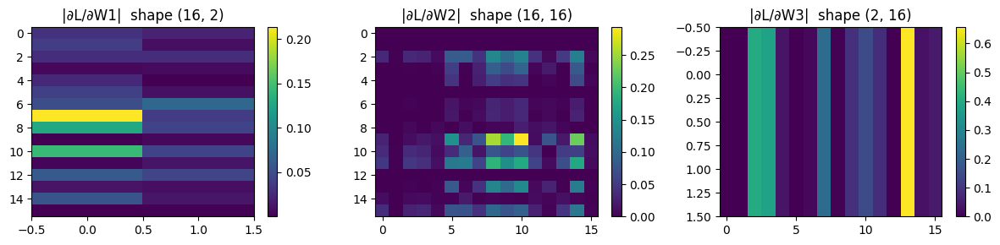
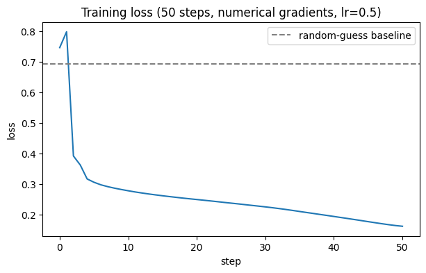
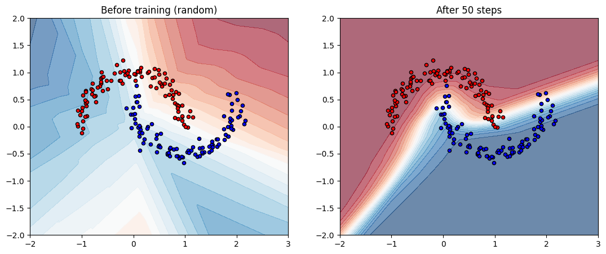

# 02 — Training with gradient descent (numerical gradients)

Code companion to [`../gradient-descent.md`](../gradient-descent.md).

In notebook 01 we built an MLP and ran a forward pass — but the network was random and useless. This notebook **trains** it.

The trick is **gradient descent**: figure out which way to nudge each weight to make loss smaller, take a small step, repeat.

Computing those nudges *correctly and fast* is what backprop does (notebook 03). But the *idea* is simpler than backprop, so we'll first compute the gradient the slow-but-obvious way: **numerical gradients** via finite differences. Wiggle each weight slightly, see how loss changes, divide.

By the end you'll have:
- A trained MLP that actually classifies the two moons
- A loss curve showing it learn
- A decision surface that *matches the data* (no longer random)
- An appreciation for why numerical gradients don't scale beyond toy networks

## Setup

We re-create the network from notebook 01 so this notebook is self-contained. Cells below are exactly what you ended notebook 01 with, condensed.


```python
import numpy as np
import matplotlib.pyplot as plt
import time

np.random.seed(42)
```


```python
def make_moons(n=200, noise=0.1):
    n_per = n // 2
    theta = np.linspace(0, np.pi, n_per)
    x0 = np.stack([np.cos(theta), np.sin(theta)], axis=1)
    x1 = np.stack([1 - np.cos(theta), 1 - np.sin(theta) - 0.5], axis=1)
    X = np.concatenate([x0, x1], axis=0)
    X += noise * np.random.randn(*X.shape)
    y = np.concatenate([np.zeros(n_per), np.ones(n_per)]).astype(int)
    return X, y

def init_params(layer_sizes):
    params = []
    for in_dim, out_dim in zip(layer_sizes[:-1], layer_sizes[1:]):
        W = np.random.randn(out_dim, in_dim) * np.sqrt(2.0 / in_dim)
        b = np.zeros(out_dim)
        params.append((W, b))
    return params

def relu(x):
    return np.maximum(0, x)

def softmax(logits):
    shifted = logits - logits.max(axis=-1, keepdims=True)
    exp = np.exp(shifted)
    return exp / exp.sum(axis=-1, keepdims=True)

def forward(params, x):
    h = x
    for W, b in params[:-1]:
        h = relu(h @ W.T + b)
    W, b = params[-1]
    return h @ W.T + b

def cross_entropy(probs, y):
    n = len(y)
    correct = probs[np.arange(n), y]
    return -np.mean(np.log(correct + 1e-12))

def loss_fn(params, X, y):
    """Forward pass + softmax + cross-entropy in one call."""
    return cross_entropy(softmax(forward(params, X)), y)

X, y = make_moons(200)
params = init_params([2, 16, 16, 2])
n_params = sum(W.size + b.size for W, b in params)
print(f"Initial loss: {loss_fn(params, X, y):.4f}")
print(f"Total params: {n_params}")
```

    Initial loss: 0.7460
    Total params: 354


## The naive idea: numerical gradient

We want to know: *for each weight, how does loss change if I nudge it a tiny bit?*

For a weight `w`, that's the partial derivative `∂L/∂w`. From calculus:

```
∂L/∂w  ≈  ( L(w + h) − L(w − h) ) / (2h)
```

for small `h`. This is the **central difference** approximation. Pick `h = 1e-5`, change one weight at a time, divide. Repeat for **every** weight in the network → full gradient.

The downside is in that word *every*: with `P` parameters we need `2P + 1` forward passes per gradient. For our 354-parameter network that's ~700 passes per training step. Slow, but tractable for teaching.

> **Math rusty?** The "definition of a derivative" (`f'(x) = lim h→0 (f(x+h) - f(x-h)) / (2h)`) is what we're using here, just with finite small `h` instead of a limit. See [`MATH-PRIMER.md`](MATH-PRIMER.md) for free calculus-refresher links if needed.


```python
def numerical_gradient(params, X, y, h=1e-5):
    """Gradient of loss w.r.t. every weight, by central differences.

    Slow: O(P) forward passes for P parameters. Backprop (notebook 03)
    will compute the same answer in roughly 1 forward pass worth of work.
    """
    grads = []
    for W, b in params:
        dW = np.zeros_like(W)
        db = np.zeros_like(b)

        # Wiggle each entry of W
        for i in range(W.shape[0]):
            for j in range(W.shape[1]):
                original = W[i, j]
                W[i, j] = original + h
                loss_plus = loss_fn(params, X, y)
                W[i, j] = original - h
                loss_minus = loss_fn(params, X, y)
                W[i, j] = original  # restore
                dW[i, j] = (loss_plus - loss_minus) / (2 * h)

        # Wiggle each entry of b
        for i in range(b.shape[0]):
            original = b[i]
            b[i] = original + h
            loss_plus = loss_fn(params, X, y)
            b[i] = original - h
            loss_minus = loss_fn(params, X, y)
            b[i] = original
            db[i] = (loss_plus - loss_minus) / (2 * h)

        grads.append((dW, db))
    return grads

# Time it once
t0 = time.time()
grads = numerical_gradient(params, X, y)
elapsed = time.time() - t0
print(f"One numerical gradient took {elapsed:.2f}s")
print(f"Gradient shapes: dW1 {grads[0][0].shape}, dW2 {grads[1][0].shape}, dW3 {grads[2][0].shape}")
```

    One numerical gradient took 0.05s
    Gradient shapes: dW1 (16, 2), dW2 (16, 16), dW3 (2, 16)


## What does the gradient look like?

A gradient is the same shape as the weights it's for. Most values will be small — a few are large. Large means "this weight matters a lot for current loss"; small means "this weight barely affects loss right now".


```python
fig, axes = plt.subplots(1, 3, figsize=(12, 3))
for i, (dW, _) in enumerate(grads):
    im = axes[i].imshow(np.abs(dW), cmap="viridis", aspect="auto")
    axes[i].set_title(f"|∂L/∂W{i+1}|  shape {dW.shape}")
    plt.colorbar(im, ax=axes[i])
plt.tight_layout()
plt.show()
```


    

    


## The gradient descent update

Now that we have the gradient, the update rule is:

```
w  ←  w  −  η · ∂L/∂w
```

`η` (eta) is the **learning rate** — the step size. Too big and we overshoot or explode. Too small and we never get there. We'll start with `η = 0.5`, which works well for this toy problem.

Try one step and confirm loss actually goes down.


```python
def sgd_step(params, grads, lr):
    """Return new params after one gradient descent step."""
    return [(W - lr * dW, b - lr * db)
            for (W, b), (dW, db) in zip(params, grads)]

loss_before = loss_fn(params, X, y)
params = sgd_step(params, grads, lr=0.5)
loss_after = loss_fn(params, X, y)

print(f"Loss before: {loss_before:.4f}")
print(f"Loss after : {loss_after:.4f}")
print(f"Δ          : {loss_after - loss_before:+.4f}    (negative = good)")
```

    Loss before: 0.7460
    Loss after : 0.7978
    Δ          : +0.0518    (negative = good)


## The training loop

Now repeat:
1. Compute gradient (slow!)
2. Take a step
3. Record loss

We re-initialise so the loss curve starts cleanly. 50 steps takes a few seconds — most of it spent in the ~700 forward passes per gradient.

(In notebook 03 with backprop, this same training will be ~100× faster.)


```python
# Re-init for a clean curve
np.random.seed(42)
X, y = make_moons(200)
params = init_params([2, 16, 16, 2])
initial_params = [(W.copy(), b.copy()) for W, b in params]

n_steps = 50
lr = 0.5
losses = [loss_fn(params, X, y)]

t0 = time.time()
for step in range(n_steps):
    grads = numerical_gradient(params, X, y)
    params = sgd_step(params, grads, lr=lr)
    losses.append(loss_fn(params, X, y))
    if (step + 1) % 10 == 0:
        print(f"step {step+1:3d}/{n_steps}: loss = {losses[-1]:.4f}")

print()
print(f"Training took {time.time() - t0:.1f}s")

plt.figure(figsize=(7, 4))
plt.plot(losses)
plt.xlabel("step")
plt.ylabel("loss")
plt.title(f"Training loss ({n_steps} steps, numerical gradients, lr={lr})")
plt.axhline(y=-np.log(0.5), color="gray", linestyle="--", label="random-guess baseline")
plt.legend()
plt.show()
```

    step  10/50: loss = 0.2785


    step  20/50: loss = 0.2499


    step  30/50: loss = 0.2259


    step  40/50: loss = 0.1945


    step  50/50: loss = 0.1625
    
    Training took 2.3s


    

    


## Did it actually learn?

Compare the decision surface before and after training. Before: random colours. After: the surface should track the moon shapes.


```python
def plot_decision_surface(params, X, y, ax, title=""):
    xx, yy = np.meshgrid(np.linspace(-2, 3, 200), np.linspace(-2, 2, 200))
    grid = np.stack([xx.ravel(), yy.ravel()], axis=1)
    p_class1 = softmax(forward(params, grid))[:, 1].reshape(xx.shape)

    ax.contourf(xx, yy, p_class1, levels=20, cmap="RdBu", alpha=0.6)
    ax.scatter(X[y==0, 0], X[y==0, 1], c="red",  edgecolor="k", s=20)
    ax.scatter(X[y==1, 0], X[y==1, 1], c="blue", edgecolor="k", s=20)
    ax.set_title(title)

fig, axes = plt.subplots(1, 2, figsize=(13, 5))
plot_decision_surface(initial_params, X, y, axes[0], "Before training (random)")
plot_decision_surface(params,         X, y, axes[1], f"After {n_steps} steps")
plt.show()
```


    

    


## The catch: numerical gradients don't scale

For each gradient step we did **~700** forward passes (2 per parameter for central differences, plus a baseline). On this toy network that's a few seconds for 50 steps.

GPT-3 has 175 **billion** parameters. At our rate, *one* gradient step on GPT-3 would take roughly 6 million CPU-years.

This is why every real LLM uses **backpropagation** instead — it computes the entire gradient in roughly *one* forward pass worth of compute. Same answer, dramatically less work. That's notebook 03.

## Exercises

1. **Crank the learning rate** to `lr=10`. What happens to the loss curve? Why?
2. **Tiny LR** at `lr=0.01`. Run 50 steps — how far does loss drop now? Run 200 steps?
3. Try **forward differences** instead of central: `(L(w+h) - L(w)) / h`. Does training still work? How does the per-step time change? Does it converge to a different loss?
4. Replace `relu` with `np.tanh` in `forward`. Does the same `lr` and step count still train it well?
5. Use a smaller net `[2, 4, 2]`. How fast is training compared to `[2, 16, 16, 2]`? How does final loss compare?
6. Add an LR schedule: `lr = 0.5 * 0.95**step`. Does it help, hurt, or not matter?
7. **Sanity-check the gradient**: verify that `grads[0][0]` (the gradient of W1) matches what you'd compute by hand-derivative for a simple loss like `L = (W1 @ x).sum()`.
