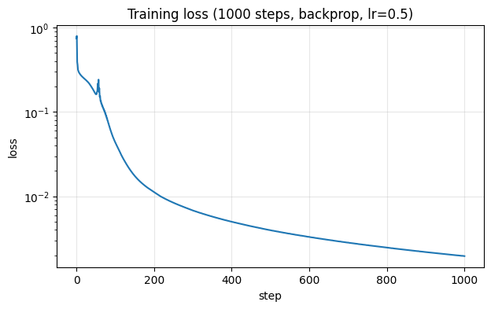
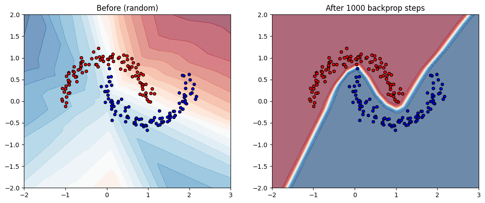

# 03 — Backpropagation: gradients done right

Code companion to [`../backpropagation.md`](../backpropagation.md).

In notebook 02 we trained an MLP using **numerical gradients** — wiggling each weight to measure how loss changed. It worked, but each gradient cost ~700 forward passes. For our 354-parameter toy network that meant a few seconds; for GPT-3 it would be 6 million CPU-years.

This notebook does it properly. We'll **derive** the gradient of loss w.r.t. each weight using calculus (the chain rule), implement it in NumPy, and verify it matches what `numerical_gradient` computes — but hundreds of times faster.

This is the algorithm that makes deep learning *possible*. Every modern framework (PyTorch, JAX, TensorFlow) is essentially "backprop, automated".

By the end:
- An understanding of the chain rule applied to a neural network
- A `backward()` function that computes the full gradient in one shot
- Numerical proof that analytical gradients match the numerical ones to ~6 decimal places
- A 100×+ speedup over notebook 02

## Setup

Reusing the network and `numerical_gradient` from notebook 02 for comparison.


```python
import numpy as np
import matplotlib.pyplot as plt
import time

np.random.seed(42)

def make_moons(n=200, noise=0.1):
    n_per = n // 2
    theta = np.linspace(0, np.pi, n_per)
    x0 = np.stack([np.cos(theta), np.sin(theta)], axis=1)
    x1 = np.stack([1 - np.cos(theta), 1 - np.sin(theta) - 0.5], axis=1)
    X = np.concatenate([x0, x1], axis=0)
    X += noise * np.random.randn(*X.shape)
    y = np.concatenate([np.zeros(n_per), np.ones(n_per)]).astype(int)
    return X, y

def init_params(layer_sizes):
    params = []
    for in_dim, out_dim in zip(layer_sizes[:-1], layer_sizes[1:]):
        W = np.random.randn(out_dim, in_dim) * np.sqrt(2.0 / in_dim)
        b = np.zeros(out_dim)
        params.append((W, b))
    return params

def relu(x):
    return np.maximum(0, x)

def softmax(logits):
    shifted = logits - logits.max(axis=-1, keepdims=True)
    exp = np.exp(shifted)
    return exp / exp.sum(axis=-1, keepdims=True)

def forward(params, x):
    h = x
    for W, b in params[:-1]:
        h = relu(h @ W.T + b)
    W, b = params[-1]
    return h @ W.T + b

def cross_entropy(probs, y):
    n = len(y)
    return -np.mean(np.log(probs[np.arange(n), y] + 1e-12))

def loss_fn(params, X, y):
    return cross_entropy(softmax(forward(params, X)), y)

def numerical_gradient(params, X, y, h=1e-5):
    grads = []
    for W, b in params:
        dW = np.zeros_like(W); db = np.zeros_like(b)
        for i in range(W.shape[0]):
            for j in range(W.shape[1]):
                orig = W[i, j]
                W[i, j] = orig + h; lp = loss_fn(params, X, y)
                W[i, j] = orig - h; lm = loss_fn(params, X, y)
                W[i, j] = orig
                dW[i, j] = (lp - lm) / (2 * h)
        for i in range(b.shape[0]):
            orig = b[i]
            b[i] = orig + h; lp = loss_fn(params, X, y)
            b[i] = orig - h; lm = loss_fn(params, X, y)
            b[i] = orig
            db[i] = (lp - lm) / (2 * h)
        grads.append((dW, db))
    return grads

X, y = make_moons(200)
params = init_params([2, 16, 16, 2])
print(f"Initial loss: {loss_fn(params, X, y):.4f}")
```

    Initial loss: 0.7460


## The plan: chain rule, output to input

The network is a *composition* of operations:

```
X  →[linear W1,b1]→  h1_pre  →[ReLU]→  h1
   →[linear W2,b2]→  h2_pre  →[ReLU]→  h2
   →[linear W3,b3]→  logits  →[softmax]→  probs  →[CE w/ y]→  loss
```

The **chain rule** says:

```
dL/dW1  =  dL/dprobs · dprobs/dlogits · dlogits/dh2 · ... · dh1_pre/dW1
```

So we walk *backwards* through the graph, multiplying local derivatives. At each layer we compute:
- The gradient of `L` w.r.t. that layer's *input* (to pass further back)
- The gradient of `L` w.r.t. that layer's *parameters* (to use in the update)

We need three local derivatives: through **softmax + cross-entropy**, through a **linear** layer, and through **ReLU**.

> **Math heavy?** This notebook uses the chain rule and matrix calculus. If either is rusty, [`MATH-PRIMER.md`](MATH-PRIMER.md) lists free resources — for backprop specifically, the [cs231n backpropagation notes](https://cs231n.github.io/optimization-2/) and Parr & Howard's [*Matrix Calculus You Need For Deep Learning*](https://explained.ai/matrix-calculus/) are the canonical references.

## Softmax + cross-entropy: the lucky cancellation

If you grind through it, the derivative of softmax alone is messy (every output depends on every input). And the derivative of `-log` is `-1/x`. But when you compose them — softmax followed by cross-entropy — almost everything cancels. The result:

```
∂L/∂logits_i  =  ( probs_i  −  y_onehot_i )  /  N
```

`y_onehot` is just the labels written as one-hot vectors (`[0, 1]` or `[1, 0]` for our 2-class problem). `N` is the batch size — divides because cross-entropy averages over examples.

That's it. The whole softmax+CE backward pass is a subtraction. (Worked derivation: see e.g. the [cs231n notes](https://cs231n.github.io/neural-networks-case-study/#grad). Worth grinding through once.)

## Linear layer

For `y = x @ W.T + b` with input shape `(N, in_dim)` and output shape `(N, out_dim)`:

```
∂L/∂W  =  (∂L/∂y).T  @  x          # shape (out_dim, in_dim)
∂L/∂b  =  sum_over_batch( ∂L/∂y )  # shape (out_dim,)
∂L/∂x  =  ∂L/∂y  @  W              # shape (N, in_dim) — to pass back
```

Derivation in one line: `y_ij = sum_k x_ik · W_jk + b_j`. Take `∂/∂W_jk` — only one term survives, which is `x_ik`. Sum over the batch dimension because each example contributes to the gradient.

## ReLU

For `y = relu(x) = max(0, x)`:

```
∂L/∂x  =  ∂L/∂y  *  (x > 0)
```

Gradient flows through wherever the pre-activation was positive, and is killed where it was negative. (At exactly `x = 0` the derivative is undefined; we pick 0 by convention. Doesn't matter in practice.)

## Putting it all together

We run the forward pass once, *saving the intermediate activations*, then walk backwards using the three local derivatives above.


```python
def backward(params, X, y):
    """Gradient of loss w.r.t. all params, analytically.

    Specific to our 3-layer MLP with ReLU + softmax/CE.
    Generalising to arbitrary depth is exercise 1.
    """
    n = len(y)
    (W1, b1), (W2, b2), (W3, b3) = params

    # --- Forward, saving intermediates we'll need on the way back ---
    h1_pre = X @ W1.T + b1
    h1     = relu(h1_pre)
    h2_pre = h1 @ W2.T + b2
    h2     = relu(h2_pre)
    logits = h2 @ W3.T + b3
    probs  = softmax(logits)

    # --- Backward ---
    # 1. Through softmax + CE
    y_onehot = np.zeros_like(probs)
    y_onehot[np.arange(n), y] = 1.0
    dlogits = (probs - y_onehot) / n

    # 2. Through last linear layer
    dW3 = dlogits.T @ h2
    db3 = dlogits.sum(axis=0)
    dh2 = dlogits @ W3

    # 3. Through ReLU
    dh2_pre = dh2 * (h2_pre > 0)

    # 4. Through second linear layer
    dW2 = dh2_pre.T @ h1
    db2 = dh2_pre.sum(axis=0)
    dh1 = dh2_pre @ W2

    # 5. Through ReLU
    dh1_pre = dh1 * (h1_pre > 0)

    # 6. Through first linear layer
    dW1 = dh1_pre.T @ X
    db1 = dh1_pre.sum(axis=0)

    return [(dW1, db1), (dW2, db2), (dW3, db3)]

# Quick sanity: shapes match
grads_a = backward(params, X, y)
for i, ((W, b), (dW, db)) in enumerate(zip(params, grads_a), start=1):
    print(f"Layer {i}: dW {dW.shape} matches W {W.shape},  db {db.shape} matches b {b.shape}")
```

    Layer 1: dW (16, 2) matches W (16, 2),  db (16,) matches b (16,)
    Layer 2: dW (16, 16) matches W (16, 16),  db (16,) matches b (16,)
    Layer 3: dW (2, 16) matches W (2, 16),  db (2,) matches b (2,)


## Sanity check: do they match?

The gradient formulas are easy to get subtly wrong (transposes especially). The right way to verify: compute both analytical *and* numerical gradients, and confirm they agree.

This is **gradient checking** — a real debugging technique you'll use any time you implement a new layer by hand.

> **A note on ReLU.** ReLU's derivative is discontinuous at zero. When `numerical_gradient` wiggles a weight by `±1e-5`, it can flip a borderline neuron from inactive to active, making the *numerical* gradient slightly wrong. Expect:
> - Layer 3 (no ReLU between it and the loss): agreement to ~1e-11 (machine precision)
> - Layers 1 and 2 (sit behind ReLUs): agreement to only ~1e-4 to 1e-6
>
> The bigger errors are the **numerical** gradient being imprecise near ReLU's kinks, **not** a bug in `backward`. The canonical write-up is in [cs231n's gradient-check notes](https://cs231n.github.io/neural-networks-3/#gradcheck) under "kinks in the objective".


```python
# Time numerical gradient (one shot — already slow)
t0 = time.perf_counter()
grads_n = numerical_gradient(params, X, y)
t_num = time.perf_counter() - t0

# Time analytical gradient (average over many runs — too fast otherwise)
n_repeats = 1000
t0 = time.perf_counter()
for _ in range(n_repeats):
    grads_a = backward(params, X, y)
t_ana = (time.perf_counter() - t0) / n_repeats

print(f"numerical:  {t_num*1e3:.1f} ms  (one call)")
print(f"analytical: {t_ana*1e6:.1f} us  (averaged over {n_repeats} calls)")
print(f"speedup:    {t_num / t_ana:,.0f}x")
print()

for i, ((dWa, dba), (dWn, dbn)) in enumerate(zip(grads_a, grads_n), start=1):
    err_W = np.abs(dWa - dWn).max()
    err_b = np.abs(dba - dbn).max()
    print(f"Layer {i}: max |dW err| = {err_W:.2e},  max |db err| = {err_b:.2e}")

print()
print("Layer 3 (no ReLU between it and the loss) gets ~1e-11 — machine-precision agreement.")
print("Layers 1-2 sit behind ReLUs and report ~1e-4 to 1e-6. That's the *numerical*")
print("gradient being slightly wrong near ReLU's kink at zero (wiggling a weight by ±h")
print("can flip a borderline neuron from inactive to active), not a bug in `backward`.")
print("See cs231n's gradient-check notes ('kinks in the objective') for the canonical write-up.")
```

    numerical:  47.7 ms  (one call)
    analytical: 109.7 us  (averaged over 1000 calls)
    speedup:    435x
    
    Layer 1: max |dW err| = 1.29e-11,  max |db err| = 8.78e-05
    Layer 2: max |dW err| = 4.90e-06,  max |db err| = 1.99e-04
    Layer 3: max |dW err| = 2.30e-11,  max |db err| = 2.48e-12
    
    Layer 3 (no ReLU between it and the loss) gets ~1e-11 — machine-precision agreement.
    Layers 1-2 sit behind ReLUs and report ~1e-4 to 1e-6. That's the *numerical*
    gradient being slightly wrong near ReLU's kink at zero (wiggling a weight by ±h
    can flip a borderline neuron from inactive to active), not a bug in `backward`.
    See cs231n's gradient-check notes ('kinks in the objective') for the canonical write-up.


## Now train with backprop

Same configuration as notebook 02, but now with the analytical gradient. Watch the wall-clock time — and crank `n_steps` because we can afford it.


```python
np.random.seed(42)
X, y = make_moons(200)
params = init_params([2, 16, 16, 2])
initial_params = [(W.copy(), b.copy()) for W, b in params]

def sgd_step(params, grads, lr):
    return [(W - lr * dW, b - lr * db)
            for (W, b), (dW, db) in zip(params, grads)]

n_steps = 1000   # 20x more than notebook 02 — backprop is fast enough
lr = 0.5
losses = [loss_fn(params, X, y)]

t0 = time.time()
for step in range(n_steps):
    grads = backward(params, X, y)
    params = sgd_step(params, grads, lr=lr)
    losses.append(loss_fn(params, X, y))
    if (step + 1) % 100 == 0:
        print(f"step {step+1:4d}/{n_steps}: loss = {losses[-1]:.4f}")

print()
print(f"Training took {time.time() - t0:.2f}s   ({n_steps} steps)")

plt.figure(figsize=(7, 4))
plt.plot(losses)
plt.xlabel("step")
plt.ylabel("loss")
plt.yscale("log")
plt.title(f"Training loss ({n_steps} steps, backprop, lr={lr})")
plt.grid(True, alpha=0.3)
plt.show()
```

    step  100/1000: loss = 0.0437


    step  200/1000: loss = 0.0112
    step  300/1000: loss = 0.0068
    step  400/1000: loss = 0.0050
    step  500/1000: loss = 0.0040
    step  600/1000: loss = 0.0033
    step  700/1000: loss = 0.0028
    step  800/1000: loss = 0.0025
    step  900/1000: loss = 0.0022


    step 1000/1000: loss = 0.0020
    
    Training took 0.20s   (1000 steps)


    

    


## Decision surface

With 1000 steps instead of 50, the classification should look much sharper than in notebook 02.


```python
def plot_decision_surface(params, X, y, ax, title=""):
    xx, yy = np.meshgrid(np.linspace(-2, 3, 200), np.linspace(-2, 2, 200))
    grid = np.stack([xx.ravel(), yy.ravel()], axis=1)
    p_class1 = softmax(forward(params, grid))[:, 1].reshape(xx.shape)
    ax.contourf(xx, yy, p_class1, levels=20, cmap="RdBu", alpha=0.6)
    ax.scatter(X[y==0, 0], X[y==0, 1], c="red",  edgecolor="k", s=20)
    ax.scatter(X[y==1, 0], X[y==1, 1], c="blue", edgecolor="k", s=20)
    ax.set_title(title)

fig, axes = plt.subplots(1, 2, figsize=(13, 5))
plot_decision_surface(initial_params, X, y, axes[0], "Before (random)")
plot_decision_surface(params,         X, y, axes[1], f"After {n_steps} backprop steps")
plt.show()
```


    

    


## What's next

You just implemented backpropagation by hand for a 3-layer MLP. Real frameworks generalise this:

- **PyTorch**, **JAX**, **TensorFlow** all do *reverse-mode automatic differentiation* — same algorithm, but they figure out the chain rule automatically from a forward pass written by you. You write `y = x @ W.T + b; loss = ...`, then call `loss.backward()`, and gradients appear in `W.grad`, `b.grad`. No manual derivation, no transposes to trip on.
- Karpathy's [**micrograd**](https://github.com/karpathy/micrograd) (~150 lines of Python) builds the same idea on a scalar `Value` class — best resource for *seeing* autograd work in detail. The full video walkthrough is excellent.

The math you just wrote scales directly to networks of any depth and any architecture. Transformers, ResNets, diffusion models — they're all this same loop with more layers and trickier forward passes.

## Exercises

1. **Generalise** `backward` to any depth `[d1, d2, ..., dk]` (loop through layers using saved activations, instead of unrolling 3 layers by hand).
2. **Add a hidden layer**: insert a third hidden layer of 8 neurons. Re-derive and update `backward`. Train and confirm it still works (and run gradient check).
3. **Replace ReLU with tanh.** Derive `dy/dx = 1 - tanh(x)**2` and update `backward`. Does training still converge?
4. **Why does the loss curve still wiggle near the end?** Try `lr = 0.1` or an LR schedule. What trade-off do you see between speed and noise?
5. **Always gradient-check** any new layer you add. The 4-line comparison block above is the template.
6. **Compare to notebook 02**: same `lr=0.5`, but 1000 steps now instead of 50 — how does final loss compare? How does training time compare?
