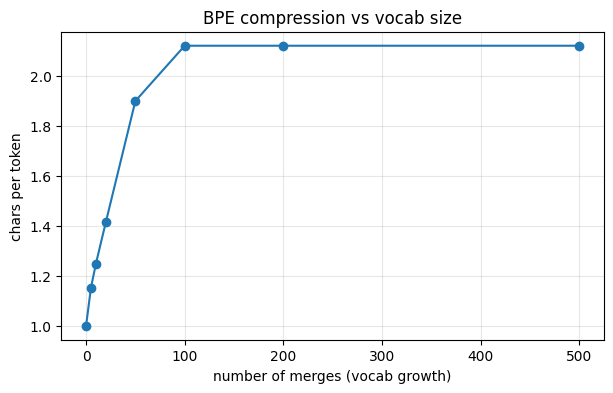

# 04 — Byte-Pair Encoding from scratch

Code companion to [`../tokenization.md`](../tokenization.md).

LLMs operate on token IDs, not characters. **BPE** is the algorithm that decides what counts as a token. It's what GPT-2/3/4, LLaMA, Mistral, and most modern LLMs use.

By the end of this notebook you'll have a working BPE tokenizer in ~30 lines of Python: train it on text, encode new strings into tokens, decode back, and see how it compares to `tiktoken`.

## The problem

We need to turn text into a sequence of integer token IDs to feed a transformer. Two obvious approaches both have major drawbacks:

| Approach | Vocab size | Sequence length | Problem |
|---|---|---|---|
| **Character-level** | ~100 | huge (1 token per char) | sequences too long; model wastes capacity on letters |
| **Word-level** | hundreds of thousands | short | unknown-word problem; bloated embedding matrix |

**BPE splits the difference**: most common words become one token (`the`, `transformer`), rare or new words split into pieces (`unbelievable` → `un`, `believ`, `able`). Adaptive vocabulary, no out-of-vocabulary problem.

## Setup

We'll train BPE on a small thematic corpus so the merges are easy to inspect by hand. Real BPE training uses gigabytes of text and hours of compute; the algorithm is identical, just scaled up.


```python
import collections
import re

text = """
the transformer architecture revolutionized machine learning. attention is all you need,
the paper claimed in 2017, and it turned out to be true. models like gpt and bert are both
derived from the transformer. self-attention lets every token attend to every other token
directly, solving the long-range dependency problem that plagued rnns and lstms. the
transformer is the substrate of every modern llm. transformers are everywhere now.
"""

# Normalise: strip, collapse whitespace, replace spaces with '_' so BPE can merge across word boundaries
text = re.sub(r"\s+", "_", text.strip())
print(f"Corpus: {len(text)} characters")
print(f"First 80 chars: {text[:80]!r}")
```

    Corpus: 437 characters
    First 80 chars: 'the_transformer_architecture_revolutionized_machine_learning._attention_is_all_y'
    

## The BPE algorithm

Three steps, repeated:

1. **Count**: count every adjacent pair of tokens in the corpus
2. **Merge**: replace every occurrence of the most-frequent pair with a new merged token
3. **Repeat** until you've done `num_merges` merges (or no pairs left)

Start with single characters as the initial vocab. Each merge grows the vocab by one. Stop when vocab is the size you want.

Three tiny functions implement this. We'll work over a flat list of tokens for clarity (real implementations chunk the corpus per word for speed).

> **Where this comes from.** BPE was originally a *compression* algorithm by Philip Gage in 1994, merging the most frequent pair of bytes in a binary file (Gage 1994). Sennrich, Haddow & Birch repurposed it for NLP tokenisation in 2016 ([arXiv:1508.07909](https://arxiv.org/abs/1508.07909)). The algorithm itself is unchanged across both uses; only the input domain (bytes vs. characters/words) and the goal (compression vs. tokenisation) differ.


```python
def get_pair_counts(tokens):
    """Count every adjacent pair (a, b) in the token sequence."""
    counts = collections.Counter()
    for pair in zip(tokens, tokens[1:]):
        counts[pair] += 1
    return counts

def merge_pair(tokens, pair):
    """Replace every occurrence of `pair` with a single merged token."""
    a, b = pair
    merged = a + b
    new = []
    i = 0
    while i < len(tokens):
        if i < len(tokens) - 1 and tokens[i] == a and tokens[i+1] == b:
            new.append(merged)
            i += 2
        else:
            new.append(tokens[i])
            i += 1
    return new

def train_bpe(text, num_merges):
    """Run BPE training. Returns the ordered list of merges and the final vocab."""
    tokens = list(text)  # initial vocab: single characters
    merges = []          # in order — the order matters for encoding new text
    for _ in range(num_merges):
        pair_counts = get_pair_counts(tokens)
        if not pair_counts:
            break
        best_pair, best_count = pair_counts.most_common(1)[0]
        if best_count < 2:
            break  # nothing useful left to merge
        merges.append(best_pair)
        tokens = merge_pair(tokens, best_pair)
    vocab = sorted(set(tokens))
    return merges, vocab

merges, vocab = train_bpe(text, num_merges=30)
print(f"Trained {len(merges)} merges; final vocab size {len(vocab)}")
```

    Trained 30 merges; final vocab size 54
    

## Inspect the merges

Each merge tells a story about what the algorithm decided was worth combining. The first merges are usually high-frequency character pairs (`th`, `er`, `_t`); later merges build up actual words.


```python
for i, (a, b) in enumerate(merges, start=1):
    print(f"merge {i:2d}: {a!r:>8} + {b!r:<8} -> {(a+b)!r}")
```

    merge  1:      '_' + 't'      -> '_t'
    merge  2:      'e' + 'r'      -> 'er'
    merge  3:      'e' + '_'      -> 'e_'
    merge  4:      '_' + 'a'      -> '_a'
    merge  5:      'd' + '_'      -> 'd_'
    merge  6:      'e' + 'n'      -> 'en'
    merge  7:      'r' + 'a'      -> 'ra'
    merge  8:     '_t' + 'h'      -> '_th'
    merge  9:     'ra' + 'n'      -> 'ran'
    merge 10:      'e' + 'v'      -> 'ev'
    merge 11:      'e' + 'd_'     -> 'ed_'
    merge 12:      'e' + '_t'     -> 'e_t'
    merge 13:    'ran' + 's'      -> 'rans'
    merge 14:   'rans' + 'f'      -> 'ransf'
    merge 15:  'ransf' + 'o'      -> 'ransfo'
    merge 16: 'ransfo' + 'r'      -> 'ransfor'
    merge 17: 'ransfor' + 'm'      -> 'ransform'
    merge 18: 'ransform' + 'er'     -> 'ransformer'
    merge 19:      'o' + 'n'      -> 'on'
    merge 20:      'i' + 'n'      -> 'in'
    merge 21:     '_t' + 'o'      -> '_to'
    merge 22:     'ev' + 'er'     -> 'ever'
    merge 23:   'ever' + 'y'      -> 'every'
    merge 24:      't' + 'h'      -> 'th'
    merge 25:    'e_t' + 'ransformer' -> 'e_transformer'
    merge 26:     '_a' + 'r'      -> '_ar'
    merge 27:      't' + 'i'      -> 'ti'
    merge 28:     'ti' + 'on'     -> 'tion'
    merge 29:      'l' + 'e'      -> 'le'
    merge 30:      'r' + 'n'      -> 'rn'
    

## Encoding and decoding

**Encoding** new text: start from characters, apply each learned merge in the order it was learned. The order matters — later merges may build on earlier ones.

**Decoding**: just concatenate the tokens (and turn `_` back into spaces).


```python
def encode(text, merges):
    text = re.sub(r"\s+", "_", text.strip())
    tokens = list(text)
    for pair in merges:
        tokens = merge_pair(tokens, pair)
    return tokens

def decode(tokens):
    return "".join(tokens).replace("_", " ")

# Round-trip test on a known phrase
sample = "the transformer is everywhere"
tokens = encode(sample, merges)
back = decode(tokens)
print(f"input  : {sample!r}")
print(f"tokens : {tokens}")
print(f"decoded: {back!r}")
assert back == sample, "round-trip failed!"
print("\nround-trip OK")
```

    input  : 'the transformer is everywhere'
    tokens : ['th', 'e_transformer', '_', 'i', 's', '_', 'every', 'w', 'h', 'er', 'e']
    decoded: 'the transformer is everywhere'
    
    round-trip OK
    

## Try it on text the tokenizer hasn't seen

BPE handles unseen text gracefully — anything it doesn't know falls back to characters.


```python
for sample in [
    "the transformer",                             # all common, should compress well
    "attention is all you need",                   # phrase from training
    "a wholly novel sequence the model never saw", # mostly novel
    "xyzzy",                                       # nonsense — falls back to chars
]:
    tokens = encode(sample, merges)
    print(f"\ninput : {sample!r}")
    print(f"tokens: {tokens}")
    print(f"count : {len(tokens)} tokens for {len(sample)} chars  ({len(sample)/len(tokens):.2f} chars/token)")
```

    
    input : 'the transformer'
    tokens: ['th', 'e_transformer']
    count : 2 tokens for 15 chars  (7.50 chars/token)
    
    input : 'attention is all you need'
    tokens: ['a', 't', 't', 'en', 'tion', '_', 'i', 's', '_a', 'l', 'l', '_', 'y', 'o', 'u', '_', 'n', 'e', 'e', 'd']
    count : 20 tokens for 25 chars  (1.25 chars/token)
    
    input : 'a wholly novel sequence the model never saw'
    tokens: ['a', '_', 'w', 'h', 'o', 'l', 'l', 'y', '_', 'n', 'o', 'v', 'e', 'l', '_', 's', 'e', 'q', 'u', 'en', 'c', 'e', '_th', 'e_', 'm', 'o', 'd', 'e', 'l', '_', 'n', 'ever', '_', 's', 'a', 'w']
    count : 36 tokens for 43 chars  (1.19 chars/token)
    
    input : 'xyzzy'
    tokens: ['x', 'y', 'z', 'z', 'y']
    count : 5 tokens for 5 chars  (1.00 chars/token)
    

## Compression and the vocab/length tradeoff

More merges = larger vocab but shorter sequences. There's a tradeoff:
- More tokens in vocab → bigger embedding matrix in your model
- Fewer merges → longer sequences → more compute per text

Real-world tokenisers use 30k–200k merges (GPT-4's `o200k_base` has 200k tokens). Let's see how compression scales with merge count on our toy corpus.


```python
import matplotlib.pyplot as plt

test_text = text  # use our training corpus to see best-case compression
merge_counts = [0, 5, 10, 20, 50, 100, 200, 500]
ratios = []

for n in merge_counts:
    if n == 0:
        n_tokens = len(list(test_text))
    else:
        m, _ = train_bpe(test_text, num_merges=n)
        n_tokens = len(encode(test_text.replace("_", " "), m))
    ratio = len(test_text) / n_tokens
    ratios.append(ratio)
    print(f"{n:4d} merges: {n_tokens:4d} tokens  ({ratio:.2f} chars/token)")

plt.figure(figsize=(7, 4))
plt.plot(merge_counts, ratios, marker="o")
plt.xlabel("number of merges (vocab growth)")
plt.ylabel("chars per token")
plt.title("BPE compression vs vocab size")
plt.grid(True, alpha=0.3)
plt.show()
```

       0 merges:  437 tokens  (1.00 chars/token)
       5 merges:  379 tokens  (1.15 chars/token)
      10 merges:  350 tokens  (1.25 chars/token)
      20 merges:  309 tokens  (1.41 chars/token)
      50 merges:  230 tokens  (1.90 chars/token)
     100 merges:  206 tokens  (2.12 chars/token)
     200 merges:  206 tokens  (2.12 chars/token)
     500 merges:  206 tokens  (2.12 chars/token)
    


    

    


## Compare to the real thing: `tiktoken`

Our implementation is character-level for clarity. Real-world tokenisers like OpenAI's `tiktoken` use **byte-level BPE** — same algorithm, but operating on raw UTF-8 bytes. That makes them robust to *any* Unicode without ever falling back to an unknown token, and lets a single tokenizer cover all languages.

Optional: install `tiktoken` (`pip install tiktoken`) and compare.


```python
try:
    import tiktoken
    enc = tiktoken.get_encoding("cl100k_base")  # GPT-3.5 / GPT-4 tokenizer
    sample = "the transformer is the substrate of every modern llm"
    ids = enc.encode(sample)
    print(f"input    : {sample!r}")
    print(f"tiktoken : {ids}")
    print(f"as text  : {[enc.decode([i]) for i in ids]}")
    print(f"count    : {len(ids)} tokens for {len(sample)} chars")
    print()
    print("Comparison: cl100k_base was trained on terabytes — it tokenises common English")
    print("into roughly one token per word, vs our toy tokenizer that's seen only a paragraph.")
except ImportError:
    print("`tiktoken` not installed. To compare:")
    print("  pip install tiktoken")
    print("then re-run this cell.")
```

    `tiktoken` not installed. To compare:
      pip install tiktoken
    then re-run this cell.
    

## What's next

You now have a tokenizer. Combined with the network from notebooks 01–03, you have everything needed to feed text to a neural net and train on it.

Next: `05-attention-by-hand.ipynb` introduces self-attention — the core operation of the transformer. Then `06-mini-gpt.ipynb` puts it all together: tokeniser + transformer + training loop = a tiny GPT.

## References

- **Gage, P. (1994).** *A New Algorithm for Data Compression.* The C Users Journal, 12(2), 23–38. The original byte-pair compression algorithm we re-purposed for tokenisation.
- **Sennrich, R., Haddow, B., & Birch, A. (2016).** *Neural Machine Translation of Rare Words with Subword Units.* ACL 2016. [arXiv:1508.07909](https://arxiv.org/abs/1508.07909). Brought BPE into NLP.
- **Kudo, T., & Richardson, J. (2018).** *SentencePiece: A simple and language independent subword tokenizer and detokenizer for Neural Text Processing.* [arXiv:1808.06226](https://arxiv.org/abs/1808.06226). The library used by LLaMA, T5, and many multilingual models.
- **Karpathy, A.** [`minbpe`](https://github.com/karpathy/minbpe) — a clean, fast, and well-documented BPE reference implementation; the [accompanying video](https://www.youtube.com/watch?v=zduSFxRajkE) walks through it line by line.
- **OpenAI.** [`tiktoken`](https://github.com/openai/tiktoken) — the byte-level BPE tokeniser used by GPT-2/3/4. Production-grade Rust.

## Exercises

1. **Train on more text.** Paste in a longer passage (a few paragraphs of a public-domain book). Look at the first 50 merges — do they correspond to common English subwords?
2. **Bytes, not chars.** Replace `list(text)` with `list(text.encode('utf-8'))` (cast bytes to ints). You now have byte-level BPE. Verify it round-trips. Try training on text with emoji or non-ASCII characters — char-level fails on these, byte-level doesn't.
3. **Speed.** Our implementation is `O(N)` per merge step. For a 1MB corpus and 1000 merges that's 1B ops — slow. The standard optimisation is to maintain per-word frequency counts so you only re-scan changed regions. Implement it (see `minbpe` in the references for a clean version).
4. **Different scoring.** Replace "merge most frequent pair" with WordPiece-style scoring: `score(a,b) = freq(a,b) / (freq(a) * freq(b))`. How do the merges differ? Which produces shorter sequences on held-out text?
5. **Compare with `tiktoken`** on the same input. How many fewer tokens does `cl100k_base` produce per character? What does that imply about the size of vocab needed for good compression?
6. **Why does encoding apply merges in order?** Try shuffling `merges` before calling `encode`. Why does it produce different (worse) results?
