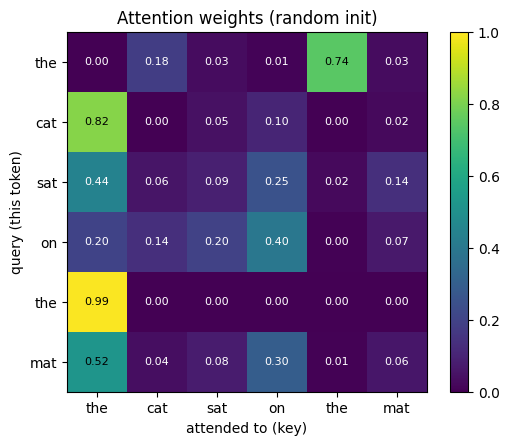
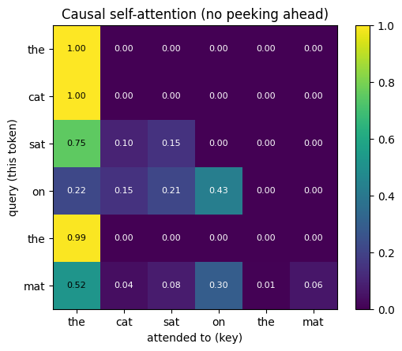
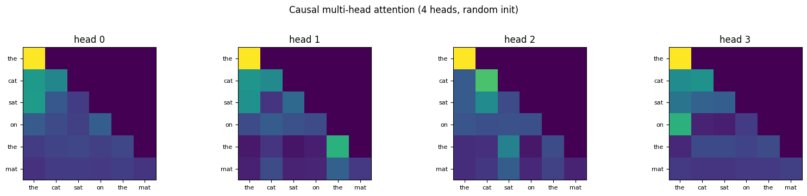

# 05 — Self-attention by hand

Code companion to [`../transformers.md`](../transformers.md).

Self-attention is the single operation that makes transformers transformers. Every other piece (multi-head, residuals, layer norm, position encodings) is plumbing around it.

By the end of this notebook:
- A working self-attention function in NumPy
- A heatmap of attention weights you can read
- Multi-head attention that splits the work across parallel projections
- A causal mask (the thing that lets GPTs generate left-to-right)
- A demonstration that attention is **permutation-equivariant** — i.e. why we need positional encodings

> **Math heavy?** This uses linear algebra (matrix multiplies, transpose, broadcasting) and softmax. If either is rusty, [`MATH-PRIMER.md`](MATH-PRIMER.md) lists free references — particularly 3Blue1Brown's *Essence of Linear Algebra* and the cs231n notes.

## The intuition

Imagine a sentence of tokens. Each token has a current representation (a vector). We want each token's *new* representation to depend on relevant other tokens — `it` in *the cat sat on the mat because **it** was tired* should pull info from `cat`.

Attention does this in three vectors per token:
- **Q** (query): what this token is looking for
- **K** (key): what this token offers
- **V** (value): the actual content to share

For each token, we score *every other token's K* against our Q, softmax those scores into weights, then take a weighted sum of *every other token's V*. That weighted sum is the new representation.

The whole formula:

```
Attention(Q, K, V) = softmax(Q @ K.T / sqrt(d_k)) @ V
```

We'll build this up step by step on a 6-token sentence.

## Setup: a tiny sentence with random embeddings

In a real model, `X` would be embedded tokens output from the embedding layer. Here we use random vectors — the math is identical.


```python
import numpy as np
import matplotlib.pyplot as plt

np.random.seed(42)

tokens = ["the", "cat", "sat", "on", "the", "mat"]
n = len(tokens)        # sequence length
d_model = 8            # tiny embedding dim — real models use 512+

# Random embeddings; learned in a real model
X = np.random.randn(n, d_model)
print(f"X shape: {X.shape}  (n_tokens, d_model)")
```

    X shape: (6, 8)  (n_tokens, d_model)
    

## Step 1: project X into Q, K, V

Three separate linear projections, one for each role. The projection matrices are what the model *learns* — different rows of `W_Q` produce queries that look for different things.


```python
d_k = 8  # dimension of Q, K, V (often d_model / num_heads in multi-head)

# Random projections — learned in real models
W_Q = np.random.randn(d_model, d_k) * 0.5
W_K = np.random.randn(d_model, d_k) * 0.5
W_V = np.random.randn(d_model, d_k) * 0.5

Q = X @ W_Q  # (n, d_k)
K = X @ W_K  # (n, d_k)
V = X @ W_V  # (n, d_k)

print(f"Q, K, V each have shape {Q.shape}  (n_tokens, d_k)")
```

    Q, K, V each have shape (6, 8)  (n_tokens, d_k)
    

## Step 2: dot-product scores `Q @ K.T`

The matrix `Q @ K.T` has shape `(n, n)`. Entry `(i, j)` is the dot product of token `i`'s query with token `j`'s key — *how much token i wants info from token j*.

We scale by `sqrt(d_k)` to keep the numbers from growing too large with bigger `d_k` (otherwise softmax saturates and gradients vanish — see Vaswani et al. 2017, footnote 4).


```python
scores = Q @ K.T / np.sqrt(d_k)   # (n, n)
print("scores shape:", scores.shape)
print("\nscores (rows = query token, cols = attended-to token):")
print(np.round(scores, 2))
```

    scores shape: (6, 6)
    
    scores (rows = query token, cols = attended-to token):
    [[-2.03  2.34  0.63 -0.75  3.76  0.62]
     [ 2.29 -3.28 -0.6   0.23 -3.67 -1.2 ]
     [ 1.35 -0.69 -0.27  0.79 -1.56  0.17]
     [-0.08 -0.47 -0.1   0.6  -3.82 -1.17]
     [ 4.74 -6.29 -1.41 -0.85 -5.98 -1.56]
     [ 1.15 -1.5  -0.76  0.58 -3.23 -0.98]]
    

## Step 3: softmax row-wise → attention weights

Softmax along each row turns the scores into a probability distribution that sums to 1. So row `i` says "of all the available tokens, here's how I weight them when computing my new representation".


```python
def softmax(x, axis=-1):
    x = x - x.max(axis=axis, keepdims=True)
    e = np.exp(x)
    return e / e.sum(axis=axis, keepdims=True)

attn = softmax(scores, axis=-1)
print("row sums (should all be ~1):", attn.sum(axis=-1))
print("\nattn weights:")
print(np.round(attn, 2))
```

    row sums (should all be ~1): [1. 1. 1. 1. 1. 1.]
    
    attn weights:
    [[0.   0.18 0.03 0.01 0.74 0.03]
     [0.82 0.   0.05 0.1  0.   0.02]
     [0.44 0.06 0.09 0.25 0.02 0.14]
     [0.2  0.14 0.2  0.4  0.   0.07]
     [0.99 0.   0.   0.   0.   0.  ]
     [0.52 0.04 0.08 0.3  0.01 0.06]]
    

## Visualise the attention weights

A heatmap is the standard view. Note: with random `W_Q`, `W_K`, the pattern is meaningless — it's just to check that *some* tokens attend to *some* others. In a trained model, this matrix is interpretable.


```python
def plot_attn(weights, tokens, title=""):
    fig, ax = plt.subplots(figsize=(5.5, 4.5))
    im = ax.imshow(weights, cmap="viridis", vmin=0, vmax=1)
    ax.set_xticks(range(len(tokens)))
    ax.set_yticks(range(len(tokens)))
    ax.set_xticklabels(tokens)
    ax.set_yticklabels(tokens)
    ax.set_xlabel("attended to (key)")
    ax.set_ylabel("query (this token)")
    ax.set_title(title)
    # Annotate cells
    for i in range(len(tokens)):
        for j in range(len(tokens)):
            ax.text(j, i, f"{weights[i,j]:.2f}", ha="center", va="center",
                    color="white" if weights[i,j] < 0.5 else "black", fontsize=8)
    plt.colorbar(im, ax=ax)
    plt.tight_layout()
    plt.show()

plot_attn(attn, tokens, title="Attention weights (random init)")
```


    

    


## Step 4: weighted sum of V → new representations

Multiply the attention weights by `V`. Each output row is a weighted average of all `V` rows — the weights are how much that token "listens" to each other token.


```python
output = attn @ V    # (n, d_k)
print(f"output shape: {output.shape}  (one new vector per token)")

# Sanity check: each output is a weighted combination of V rows
manual = np.zeros_like(output)
for i in range(n):
    for j in range(n):
        manual[i] += attn[i, j] * V[j]
print("matches manual loop:", np.allclose(output, manual))
```

    output shape: (6, 8)  (one new vector per token)
    matches manual loop: True
    

## Wrap it up as a function


```python
def attention(X, W_Q, W_K, W_V, mask=None):
    """Single-head self-attention.

    X:    (n, d_model)
    W_*:  (d_model, d_k)
    mask: optional (n, n) bool — True = block this position

    Returns: output (n, d_k), attention weights (n, n)
    """
    Q = X @ W_Q
    K = X @ W_K
    V = X @ W_V
    d_k = Q.shape[-1]

    scores = Q @ K.T / np.sqrt(d_k)
    if mask is not None:
        scores = np.where(mask, -np.inf, scores)

    weights = softmax(scores, axis=-1)
    return weights @ V, weights

out, w = attention(X, W_Q, W_K, W_V)
print("works; output shape:", out.shape)
```

    works; output shape: (6, 8)
    

## Causal masking — blocking the future

Decoder transformers (GPT-style) generate text left-to-right. Token `t` must only see tokens `0..t`. We enforce this by setting future positions in the score matrix to `-inf` *before* softmax — softmax sends `-inf` to 0, killing those weights.

The mask is the upper triangle of an `(n, n)` matrix:


```python
def causal_mask(n):
    """True where future positions are (to be blocked)."""
    return np.triu(np.ones((n, n), dtype=bool), k=1)

mask = causal_mask(n)
print("causal mask (1 = blocked, 0 = allowed):")
print(mask.astype(int))

_, w_causal = attention(X, W_Q, W_K, W_V, mask=mask)
plot_attn(w_causal, tokens, title="Causal self-attention (no peeking ahead)")
```

    causal mask (1 = blocked, 0 = allowed):
    [[0 1 1 1 1 1]
     [0 0 1 1 1 1]
     [0 0 0 1 1 1]
     [0 0 0 0 1 1]
     [0 0 0 0 0 1]
     [0 0 0 0 0 0]]
    


    

    


## Multi-head attention

One attention head can only attend to one set of patterns. **Multi-head** runs `h` attention computations in parallel with different projection matrices, then concatenates the outputs and projects back to `d_model`.

This lets different heads learn different patterns — one might track syntax, another coreference, etc.

Implementation: instead of `h` separate `(d_model, d_k)` matrices, use one big `(d_model, d_model)` matrix and reshape the output into `(n, h, d_k)`.


```python
def multi_head_attention(X, W_Q, W_K, W_V, W_O, num_heads, mask=None):
    """Multi-head self-attention.

    W_Q, W_K, W_V: (d_model, d_model) — covers all heads at once
    W_O:           (d_model, d_model) — final output projection
    """
    n, d_model = X.shape
    d_k = d_model // num_heads

    Q = X @ W_Q                                     # (n, d_model)
    K = X @ W_K
    V = X @ W_V

    # Reshape (n, d_model) -> (n, h, d_k) -> (h, n, d_k)
    Q = Q.reshape(n, num_heads, d_k).transpose(1, 0, 2)
    K = K.reshape(n, num_heads, d_k).transpose(1, 0, 2)
    V = V.reshape(n, num_heads, d_k).transpose(1, 0, 2)

    scores = Q @ K.transpose(0, 2, 1) / np.sqrt(d_k)  # (h, n, n)
    if mask is not None:
        scores = np.where(mask[None, :, :], -np.inf, scores)
    weights = softmax(scores, axis=-1)                # (h, n, n)
    head_out = weights @ V                            # (h, n, d_k)

    # Concat heads back: (h, n, d_k) -> (n, h, d_k) -> (n, d_model)
    concat = head_out.transpose(1, 0, 2).reshape(n, d_model)
    return concat @ W_O, weights

# Try it
num_heads = 4
W_Qm = np.random.randn(d_model, d_model) * 0.3
W_Km = np.random.randn(d_model, d_model) * 0.3
W_Vm = np.random.randn(d_model, d_model) * 0.3
W_O  = np.random.randn(d_model, d_model) * 0.3

out_mh, w_mh = multi_head_attention(X, W_Qm, W_Km, W_Vm, W_O, num_heads=num_heads, mask=causal_mask(n))
print(f"MHA output shape: {out_mh.shape}  (n, d_model)")
print(f"MHA weights shape: {w_mh.shape}  (num_heads, n, n)")

fig, axes = plt.subplots(1, num_heads, figsize=(16, 3.5))
for h in range(num_heads):
    axes[h].imshow(w_mh[h], cmap="viridis", vmin=0, vmax=1)
    axes[h].set_title(f"head {h}")
    axes[h].set_xticks(range(n)); axes[h].set_yticks(range(n))
    axes[h].set_xticklabels(tokens, fontsize=8); axes[h].set_yticklabels(tokens, fontsize=8)
plt.suptitle(f"Causal multi-head attention ({num_heads} heads, random init)", y=1.02)
plt.tight_layout()
plt.show()
```

    MHA output shape: (6, 8)  (n, d_model)
    MHA weights shape: (4, 6, 6)  (num_heads, n, n)
    


    

    


## Why we need positional encodings

Self-attention has no notion of position — the formula is symmetric in the order of K/V rows. Shuffle the tokens and the *output also shuffles* by the same permutation, but no information about *order* is used.

Let's prove it:


```python
perm = np.array([2, 0, 4, 5, 1, 3])
X_shuf = X[perm]

out_orig, _ = attention(X,      W_Q, W_K, W_V)
out_shuf, _ = attention(X_shuf, W_Q, W_K, W_V)

# Output for shuffled input == shuffled output of original
diff = np.abs(out_shuf - out_orig[perm]).max()
print(f"Max difference between out_shuf and out_orig[perm]: {diff:.2e}")
print("(should be ~0 — confirms permutation-equivariance)")
print()
print("Implication: attention alone treats 'the cat sat on the mat' and any")
print("reshuffling identically. To use word order, real transformers add")
print("**positional encodings** to X — sinusoidal (original paper), learned")
print("(GPT-2), or rotary/RoPE (LLaMA, modern LLMs). See ../transformers.md.")
```

    Max difference between out_shuf and out_orig[perm]: 2.22e-16
    (should be ~0 — confirms permutation-equivariance)
    
    Implication: attention alone treats 'the cat sat on the mat' and any
    reshuffling identically. To use word order, real transformers add
    **positional encodings** to X — sinusoidal (original paper), learned
    (GPT-2), or rotary/RoPE (LLaMA, modern LLMs). See ../transformers.md.
    

## What's next

You have all the pieces of a transformer block:
- Multi-head self-attention (here)
- Feedforward MLP (notebook 01)
- Residual connections + layer norm (background, see [`../backpropagation.md`](../backpropagation.md))

Next: [`06-mini-gpt.ipynb`](06-mini-gpt.ipynb) (planned) — assemble these into a tiny GPT in PyTorch and train it on a small text corpus. PyTorch will handle backprop for us — gradients through attention by hand are doable but tedious.

## Exercises

1. **Attention is content-based, not position-based.** Construct two `X` matrices where token vectors are identical but in different orders. Confirm `attention()` outputs are also just permutations of each other.
2. **Add a sinusoidal positional encoding** to `X` (search "sinusoidal positional encoding numpy" — it's a one-liner). Re-run the permutation test from above. Now the outputs *don't* match — order matters.
3. **Causal vs bidirectional.** Run `attention()` with and without `causal_mask(n)`. Visualise both heatmaps side-by-side. Which model type uses each?
4. **Why scale by `sqrt(d_k)`?** Generate `Q` and `K` with very large `d_k` (say 1000) and *no* scaling. What does the resulting `attn` matrix look like? Why?
5. **Single head, very large `d_k` vs multi-head, smaller `d_k`.** With the same total parameter count, which would you expect to learn richer attention patterns? Why does the original transformer paper choose multi-head?
6. **Speed.** Attention is `O(n²)` in sequence length. Time `attention()` for `n = 100, 500, 1000, 2000`. Plot. This is the bottleneck FlashAttention and the long-context tricks in [`../transformers.md`](../transformers.md) try to mitigate.
