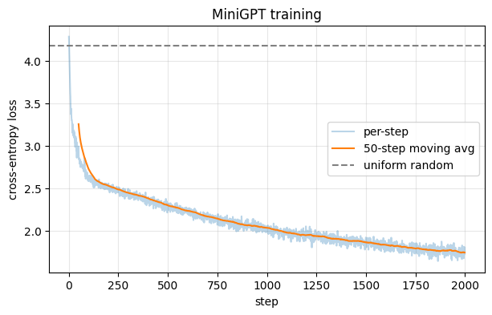

# 06 — A tiny GPT in PyTorch

Code companion to [`../transformers.md`](../transformers.md).

We've built every piece separately — MLPs (notebook 01), gradients (02), backprop (03), tokenisation (04), attention (05). Now we assemble them into a working **decoder-only transformer** (the GPT architecture), train it on a small text, and generate samples.

We'll use **PyTorch** — same backprop you derived in notebook 03, but now `loss.backward()` does the math for us. Time to stop deriving gradients and start training.

**Inspired by Karpathy's [nanoGPT](https://github.com/karpathy/nanoGPT).** That repo is the gold-standard reference once you finish here.

## What you'll build

- A character-level tokeniser on Tiny Shakespeare (~1MB of plays)
- A causal self-attention module (the attention from notebook 05, in PyTorch)
- A transformer block (attention + MLP + residuals + layer norm)
- A `MiniGPT` model: ~800K params, 4 layers, 4 heads, 128-dim embeddings
- A training loop that trains on CPU in a few minutes
- A generation function that produces Shakespeare-flavored text

## Setup

PyTorch is needed (`pip install torch` — CPU-only build is fine, ~200 MB).

Internet needed once to fetch Tiny Shakespeare (`~1 MB` from a public mirror).


```python
import torch
import torch.nn as nn
import torch.nn.functional as F

torch.manual_seed(42)
device = "cuda" if torch.cuda.is_available() else "cpu"
print(f"PyTorch {torch.__version__}, using {device}")
```

    PyTorch 2.11.0+cpu, using cpu


## Dataset: Tiny Shakespeare

~1 MB of Shakespeare's plays, the classic teaching dataset for character-level language modelling. We'll download it (cached locally) and use **character-level** tokenisation — each unique character is a token. Vocab size ends up around 65.


```python
import os, urllib.request

DATA_URL = "https://raw.githubusercontent.com/karpathy/char-rnn/master/data/tinyshakespeare/input.txt"
DATA_PATH = "tinyshakespeare.txt"

if not os.path.exists(DATA_PATH):
    print("Downloading Tiny Shakespeare (~1MB)...")
    urllib.request.urlretrieve(DATA_URL, DATA_PATH)

with open(DATA_PATH, encoding="utf-8") as f:
    text = f.read()

print(f"length: {len(text):,} characters")
print(f"\nfirst 200 chars:\n{text[:200]}")
```

    Downloading Tiny Shakespeare (~1MB)...
    length: 1,115,394 characters
    
    first 200 chars:
    First Citizen:
    Before we proceed any further, hear me speak.
    
    All:
    Speak, speak.
    
    First Citizen:
    You are all resolved rather to die than to famish?
    
    All:
    Resolved. resolved.
    
    First Citizen:
    First, you


```python
# Character-level tokenizer (much simpler than the BPE in notebook 04)
chars = sorted(set(text))
vocab_size = len(chars)
ctoi = {c: i for i, c in enumerate(chars)}
itoc = {i: c for i, c in enumerate(chars)}

def encode(s): return [ctoi[c] for c in s]
def decode(ids): return "".join(itoc[i] for i in ids)

# Sanity check round-trip
sample = "To be or not to be"
assert decode(encode(sample)) == sample

data = torch.tensor(encode(text), dtype=torch.long)
split = int(0.9 * len(data))
train_data, val_data = data[:split], data[split:]

print(f"vocab_size:   {vocab_size}")
print(f"train tokens: {len(train_data):,}")
print(f"val tokens:   {len(val_data):,}")
print(f"\ncharacters: {''.join(chars)!r}")
```

    vocab_size:   65
    train tokens: 1,003,854
    val tokens:   111,540
    
    characters: "\n !$&',-.3:;?ABCDEFGHIJKLMNOPQRSTUVWXYZabcdefghijklmnopqrstuvwxyz"


```python
# Sample random chunks of length block_size for training batches
BLOCK_SIZE = 64    # context length: each sequence is 64 tokens
BATCH_SIZE = 32

def get_batch(split="train"):
    d = train_data if split == "train" else val_data
    # Random starting indices
    ix = torch.randint(len(d) - BLOCK_SIZE - 1, (BATCH_SIZE,))
    x = torch.stack([d[i : i + BLOCK_SIZE] for i in ix])
    y = torch.stack([d[i + 1 : i + BLOCK_SIZE + 1] for i in ix])  # shifted by one
    return x.to(device), y.to(device)

xb, yb = get_batch()
print(f"x shape: {xb.shape}    y shape: {yb.shape}")
print(f"x[0]: {decode(xb[0].tolist())!r}")
print(f"y[0]: {decode(yb[0].tolist())!r}  <-- shifted by one")
```

    x shape: torch.Size([32, 64])    y shape: torch.Size([32, 64])
    x[0]: 'd, lips, O you\nThe doors of breath, seal with a righteous kiss\nA'
    y[0]: ', lips, O you\nThe doors of breath, seal with a righteous kiss\nA '  <-- shifted by one


## The model — a tiny GPT

Three components:
1. **`CausalSelfAttention`** — exactly the math from notebook 05, now in PyTorch (multi-head, causal)
2. **`Block`** — one transformer block: attention + MLP, with residuals and layer norm
3. **`MiniGPT`** — token embeddings + position embeddings + N blocks + final linear projection to vocab

Architecture is decoder-only (GPT-style): every block has causal self-attention so position `t` can only attend to positions `≤ t`. Trained to predict the next token at every position.


```python
class CausalSelfAttention(nn.Module):
    """Multi-head causal self-attention. Same math as notebook 05."""
    def __init__(self, d_model, num_heads, block_size):
        super().__init__()
        assert d_model % num_heads == 0
        self.num_heads = num_heads
        self.d_k = d_model // num_heads

        # One projection produces Q, K, V for all heads at once
        self.qkv = nn.Linear(d_model, 3 * d_model, bias=False)
        self.proj = nn.Linear(d_model, d_model, bias=False)

        # Causal mask: lower-triangular -> allowed positions are True
        mask = torch.tril(torch.ones(block_size, block_size, dtype=torch.bool))
        self.register_buffer("mask", mask)

    def forward(self, x):
        B, T, C = x.shape
        q, k, v = self.qkv(x).chunk(3, dim=-1)              # each: (B, T, d_model)
        # Split into heads: (B, T, d_model) -> (B, num_heads, T, d_k)
        q = q.view(B, T, self.num_heads, self.d_k).transpose(1, 2)
        k = k.view(B, T, self.num_heads, self.d_k).transpose(1, 2)
        v = v.view(B, T, self.num_heads, self.d_k).transpose(1, 2)

        scores = (q @ k.transpose(-2, -1)) / (self.d_k ** 0.5)   # (B, h, T, T)
        scores = scores.masked_fill(~self.mask[:T, :T], float("-inf"))
        attn = F.softmax(scores, dim=-1)

        y = attn @ v                                              # (B, h, T, d_k)
        y = y.transpose(1, 2).contiguous().view(B, T, C)          # concat heads
        return self.proj(y)


class Block(nn.Module):
    """One transformer block: pre-norm attention + MLP, both with residuals."""
    def __init__(self, d_model, num_heads, block_size):
        super().__init__()
        self.ln1  = nn.LayerNorm(d_model)
        self.attn = CausalSelfAttention(d_model, num_heads, block_size)
        self.ln2  = nn.LayerNorm(d_model)
        self.mlp  = nn.Sequential(
            nn.Linear(d_model, 4 * d_model),
            nn.GELU(),
            nn.Linear(4 * d_model, d_model),
        )

    def forward(self, x):
        x = x + self.attn(self.ln1(x))
        x = x + self.mlp(self.ln2(x))
        return x


class MiniGPT(nn.Module):
    def __init__(self, vocab_size, d_model=128, num_heads=4, num_layers=4, block_size=64):
        super().__init__()
        self.block_size = block_size
        self.token_emb = nn.Embedding(vocab_size, d_model)
        self.pos_emb   = nn.Embedding(block_size, d_model)
        self.blocks    = nn.ModuleList([Block(d_model, num_heads, block_size) for _ in range(num_layers)])
        self.ln_f      = nn.LayerNorm(d_model)
        self.head      = nn.Linear(d_model, vocab_size, bias=False)

    def forward(self, idx, targets=None):
        B, T = idx.shape
        pos = torch.arange(T, device=idx.device)
        x = self.token_emb(idx) + self.pos_emb(pos)
        for block in self.blocks:
            x = block(x)
        x = self.ln_f(x)
        logits = self.head(x)                                          # (B, T, vocab_size)

        loss = None
        if targets is not None:
            loss = F.cross_entropy(logits.reshape(-1, logits.size(-1)), targets.reshape(-1))
        return logits, loss

    @torch.no_grad()
    def generate(self, idx, max_new_tokens, temperature=1.0):
        """Sample max_new_tokens given the prompt in `idx` (shape (1, T))."""
        for _ in range(max_new_tokens):
            idx_cond = idx[:, -self.block_size:]    # crop to context window
            logits, _ = self(idx_cond)
            logits = logits[:, -1, :] / temperature
            probs = F.softmax(logits, dim=-1)
            next_tok = torch.multinomial(probs, num_samples=1)
            idx = torch.cat([idx, next_tok], dim=1)
        return idx


model = MiniGPT(vocab_size=vocab_size, d_model=128, num_heads=4, num_layers=4, block_size=BLOCK_SIZE).to(device)
n_params = sum(p.numel() for p in model.parameters())
print(f"params: {n_params:,}")
```

    params: 816,128


## Try it untrained

Sample from the random model. Expected output: pure gibberish — the network has no idea what English looks like yet.


```python
context = torch.zeros((1, 1), dtype=torch.long, device=device)  # "\n" at index 0
untrained = model.generate(context, max_new_tokens=200, temperature=1.0)
print(decode(untrained[0].tolist()))
```

    
    v
    3,LD,KwsI
    -d-VJlwAOYwji'X3k'$NtV$wMvc:-sXL'HmcTmDr3DGnBtfXiqB:
    qGsx&R
    !aD$h
    DNKDq.n$TqZvHg
    cxX&eUfYhauNi:eEcYuZ3JAir3JyLUsYb:Gm:INE
    nBYUQEKZ:jAxgqdLcXInNawbn$FxcRyQGh:qdKF33b$v
    k-IbMctZ:-t'e3sJb$mHc


## Training

Standard transformer training loop:
1. Sample a random batch from the training set
2. Forward pass → loss (cross-entropy on next-token prediction)
3. `loss.backward()` (autograd handles the chain rule we did in notebook 03)
4. Optimizer step (AdamW — see [`../gradient-descent.md`](../gradient-descent.md))
5. Repeat

On CPU this should take **2–5 minutes** for 2000 steps. If you have a GPU, it's seconds. Initial loss should be near `log(vocab_size) ≈ 4.17` (uniform random over vocab); it should drop steadily.


```python
import math, time

n_steps = 2000
lr = 3e-4
eval_interval = 200

optimizer = torch.optim.AdamW(model.parameters(), lr=lr)

@torch.no_grad()
def estimate_val_loss(n_batches=10):
    model.eval()
    losses = []
    for _ in range(n_batches):
        xb, yb = get_batch("val")
        _, loss = model(xb, yb)
        losses.append(loss.item())
    model.train()
    return sum(losses) / len(losses)

train_losses = []
print(f"Starting training. Initial uniform-random baseline loss: {math.log(vocab_size):.3f}")
t0 = time.time()

for step in range(n_steps):
    xb, yb = get_batch("train")
    _, loss = model(xb, yb)
    optimizer.zero_grad()
    loss.backward()
    optimizer.step()
    train_losses.append(loss.item())

    if (step + 1) % eval_interval == 0:
        val = estimate_val_loss()
        elapsed = time.time() - t0
        print(f"step {step+1:4d}/{n_steps}  train {loss.item():.3f}  val {val:.3f}   ({elapsed:.0f}s elapsed)")

print(f"\nTotal training time: {time.time() - t0:.0f}s")
```

    Starting training. Initial uniform-random baseline loss: 4.174


    step  200/2000  train 2.505  val 2.511   (19s elapsed)


    step  400/2000  train 2.382  val 2.381   (37s elapsed)


    step  600/2000  train 2.197  val 2.244   (56s elapsed)


    step  800/2000  train 2.179  val 2.152   (74s elapsed)


    step 1000/2000  train 2.035  val 2.072   (92s elapsed)


    step 1200/2000  train 1.971  val 2.018   (111s elapsed)


    step 1400/2000  train 1.826  val 1.960   (130s elapsed)


    step 1600/2000  train 1.831  val 1.934   (149s elapsed)


    step 1800/2000  train 1.782  val 1.904   (167s elapsed)


    step 2000/2000  train 1.736  val 1.869   (186s elapsed)
    
    Total training time: 186s


```python
import matplotlib.pyplot as plt

# Smooth the noisy per-step loss with a moving average
import numpy as np
window = 50
smoothed = np.convolve(train_losses, np.ones(window)/window, mode="valid")

plt.figure(figsize=(7, 4))
plt.plot(train_losses, alpha=0.3, label="per-step")
plt.plot(range(window-1, len(train_losses)), smoothed, label=f"{window}-step moving avg")
plt.axhline(y=math.log(vocab_size), color="gray", linestyle="--", label="uniform random")
plt.xlabel("step")
plt.ylabel("cross-entropy loss")
plt.title("MiniGPT training")
plt.legend()
plt.grid(True, alpha=0.3)
plt.show()
```


    

    


## Generate after training

What did 800K params + a few minutes of training learn? Probably:
- Realistic word lengths and spaces
- Common English letter co-occurrences (`th`, `he`, `ing`)
- Shakespeare-y dialogue formatting (`SPEAKER:` blocks, line breaks)
- Occasional real words
- *Not* coherent meaning. We're at ~800K params; GPT-3 is 220,000× bigger

Try different temperatures: low = repetitive and confident, high = creative and chaotic.


```python
for temp in [0.5, 1.0, 1.4]:
    print(f"\n=== temperature = {temp} ===")
    out = model.generate(context, max_new_tokens=300, temperature=temp)
    print(decode(out[0].tolist()))
```

    
    === temperature = 0.5 ===


    
    
    ANGELO:
    A prace why comme, and in my hears,
    I see wake and live to the son and live Romeo:
    The donother, seep besing and the doner,
    And that with make the sough sires, and well them and
    I will head trate for here will word the many his fares;
    First a his insing the speerry brother of sunder,
    And th
    
    === temperature = 1.0 ===


    
    BONTENLIO:
    they thy dood Llaw not, I for carly,
    And indersel aboutony anatiment:s: a, as and'shongess beforge.
    As 'Tis girds by pryonss to And ten:
    Well I cance missone, see and thy buide apt
    Romsely has backings gived is and musmakelly.
    
    SIDICHORD:
    I Last me treme Towcrule,
    The shat you dome, bor b
    
    === temperature = 1.4 ===


    
    TwY evih pres,
    Ap Paver tay, if her do lehat you
    Imaduil CapiooUy:
    A; it., my Hawn hend appily.
    Wilt lence usourtunablove, andlervius.
    To On met, I keep
    Os overdegres Swick: i;
    Tign:-him indencio, I to:; Or,
    So so thrombley p, kiring'Dardany nay': y.
    My--aly himy imfcounots: my whunk
    You,
    Ibamy mare


## What you just built

An honest-to-goodness GPT. The architecture is identical to GPT-3 / GPT-4 / Claude — the only differences are:

| | Your MiniGPT | Modern frontier LLMs |
|---|---|---|
| Layers | 4 | 50–120 |
| Hidden dim | 128 | 4096–25000 |
| Heads | 4 | 32–128 |
| Context | 64 tokens | 100k–2M tokens |
| Tokeniser | char-level | byte-level BPE |
| Params | ~800K | 7B–~2T |
| Training data | 1 MB | 10–30 TB |
| Training compute | minutes on a laptop | months on thousands of GPUs |

Same formula. The scale-up *just* requires money and engineering — no new ideas.

## What's next

- **Scale**: notebook 07 (planned) is a `.py` script with a real training loop — LR schedule, gradient clipping, mixed-precision, logging
- **Fine-tune a real model**: notebook 08 (planned) takes a *pretrained* small model (e.g. SmolLM 360M) and fine-tunes it via SFT + DPO on Colab
- **Inference tricks**: notebook 09 (planned) — KV cache, sampling strategies (top-p, top-k, min-p), why prefill is fast and decode is slow

## Exercises

1. **Bigger model.** Bump `d_model=256`, `num_layers=6`. How does final loss change? Training time?
2. **Bigger context.** Try `BLOCK_SIZE=128`. Loss should drop further (more context = easier prediction). Why is the speedup *less* than 2×?
3. **Longer training.** Run `n_steps=5000` or `10000`. Does val loss keep dropping or start to overfit? Plot train vs val.
4. **BPE instead of char-level.** Use the BPE tokeniser from notebook 04 (or `tiktoken`). What's the new vocab size? How does it change the training dynamics?
5. **Different text.** Replace Tiny Shakespeare with Python source code (e.g. cpython stdlib). Train. Does the model produce plausible-looking Python after training?
6. **Sampling tricks.** Add top-k or top-p sampling to `generate`. How does output quality change at the same temperature?
7. **No positional embedding.** Comment out `+ self.pos_emb(pos)` in `forward`. Train. The model should perform much worse — why? (Hint: notebook 05's permutation-equivariance demo.)
