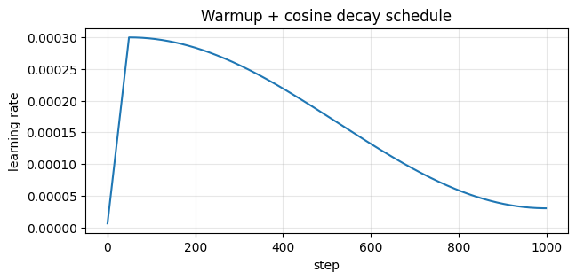
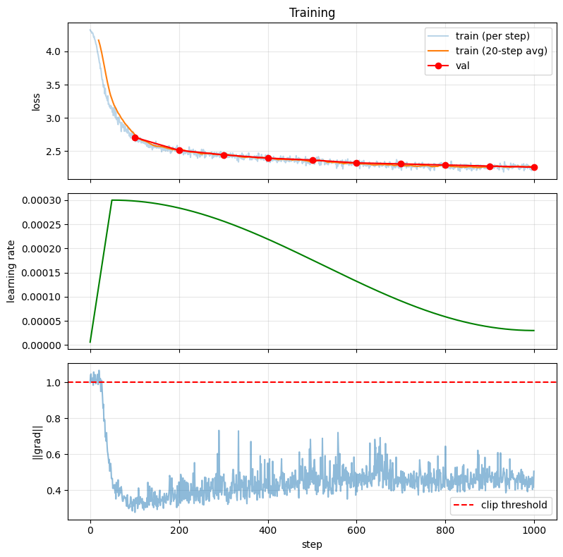

# 07 — A production-style training loop

Code companion to [`../llm-training.md`](../llm-training.md).

Notebook 06 trained a tiny GPT in the *simplest possible* loop. Real LLM training adds five things on top of that:

1. **Learning-rate schedule** — warmup then cosine decay
2. **Gradient clipping** — cap gradient norm so a bad batch can't blow up training
3. **Train/val tracking** — periodic eval, best-loss tracking
4. **Checkpointing** — save the model state so you can resume
5. **Mixed precision** — train in bf16/fp16 to use half the memory and run faster

We'll add (1)–(4) explicitly. (5) is essentially a no-op on CPU and only matters on a GPU, so we'll show the code pattern but not actually exercise it. The combination of these is what scales from "toy model trains" to "frontier LLM trains" — there are no other secrets.

## Setup

Reusing the model and tokeniser from notebook 06.


```python
import os, math, time, urllib.request
import torch
import torch.nn as nn
import torch.nn.functional as F
import matplotlib.pyplot as plt

torch.manual_seed(42)
device = "cuda" if torch.cuda.is_available() else "cpu"
print(f"PyTorch {torch.__version__}, device {device}")

# Tiny Shakespeare (cached if 06 already downloaded it)
DATA_URL = "https://raw.githubusercontent.com/karpathy/char-rnn/master/data/tinyshakespeare/input.txt"
DATA_PATH = "tinyshakespeare.txt"
if not os.path.exists(DATA_PATH):
    urllib.request.urlretrieve(DATA_URL, DATA_PATH)
with open(DATA_PATH, encoding="utf-8") as f:
    text = f.read()

chars = sorted(set(text))
vocab_size = len(chars)
ctoi = {c: i for i, c in enumerate(chars)}
itoc = {i: c for i, c in enumerate(chars)}
encode = lambda s: [ctoi[c] for c in s]
decode = lambda ids: "".join(itoc[i] for i in ids)

data = torch.tensor(encode(text), dtype=torch.long)
split = int(0.9 * len(data))
train_data, val_data = data[:split], data[split:]

BLOCK_SIZE = 64
BATCH_SIZE = 32

def get_batch(split="train"):
    d = train_data if split == "train" else val_data
    ix = torch.randint(len(d) - BLOCK_SIZE - 1, (BATCH_SIZE,))
    x = torch.stack([d[i : i + BLOCK_SIZE] for i in ix])
    y = torch.stack([d[i + 1 : i + BLOCK_SIZE + 1] for i in ix])
    return x.to(device), y.to(device)

print(f"vocab_size: {vocab_size}, train tokens: {len(train_data):,}")
```

    PyTorch 2.11.0+cpu, device cpu
    vocab_size: 65, train tokens: 1,003,854


```python
# Same MiniGPT as notebook 06 (compact)
class CausalSelfAttention(nn.Module):
    def __init__(self, d_model, num_heads, block_size):
        super().__init__()
        self.num_heads, self.d_k = num_heads, d_model // num_heads
        self.qkv  = nn.Linear(d_model, 3*d_model, bias=False)
        self.proj = nn.Linear(d_model, d_model, bias=False)
        self.register_buffer("mask", torch.tril(torch.ones(block_size, block_size, dtype=torch.bool)))
    def forward(self, x):
        B, T, C = x.shape
        q, k, v = self.qkv(x).chunk(3, dim=-1)
        q = q.view(B, T, self.num_heads, self.d_k).transpose(1, 2)
        k = k.view(B, T, self.num_heads, self.d_k).transpose(1, 2)
        v = v.view(B, T, self.num_heads, self.d_k).transpose(1, 2)
        s = (q @ k.transpose(-2,-1)) / (self.d_k ** 0.5)
        s = s.masked_fill(~self.mask[:T,:T], float("-inf"))
        y = F.softmax(s, dim=-1) @ v
        return self.proj(y.transpose(1,2).contiguous().view(B, T, C))

class Block(nn.Module):
    def __init__(self, d_model, num_heads, block_size):
        super().__init__()
        self.ln1, self.ln2 = nn.LayerNorm(d_model), nn.LayerNorm(d_model)
        self.attn = CausalSelfAttention(d_model, num_heads, block_size)
        self.mlp  = nn.Sequential(nn.Linear(d_model, 4*d_model), nn.GELU(), nn.Linear(4*d_model, d_model))
    def forward(self, x):
        x = x + self.attn(self.ln1(x))
        x = x + self.mlp(self.ln2(x))
        return x

class MiniGPT(nn.Module):
    def __init__(self, vocab_size, d_model=128, num_heads=4, num_layers=4, block_size=64):
        super().__init__()
        self.block_size = block_size
        self.token_emb = nn.Embedding(vocab_size, d_model)
        self.pos_emb   = nn.Embedding(block_size, d_model)
        self.blocks    = nn.ModuleList([Block(d_model, num_heads, block_size) for _ in range(num_layers)])
        self.ln_f      = nn.LayerNorm(d_model)
        self.head      = nn.Linear(d_model, vocab_size, bias=False)
    def forward(self, idx, targets=None):
        B, T = idx.shape
        x = self.token_emb(idx) + self.pos_emb(torch.arange(T, device=idx.device))
        for block in self.blocks: x = block(x)
        logits = self.head(self.ln_f(x))
        loss = None if targets is None else F.cross_entropy(logits.reshape(-1, logits.size(-1)), targets.reshape(-1))
        return logits, loss

model = MiniGPT(vocab_size).to(device)
print(f"params: {sum(p.numel() for p in model.parameters()):,}")
```

    params: 816,128


## 1. Learning-rate schedule

A constant LR makes early training unstable (gradients are huge from random init) and late training noisy (you need smaller steps to settle). Modern recipe:

- **Warmup** for the first ~5% of steps: linearly ramp LR from 0 to peak
- **Cosine decay** the remaining 95%: decay smoothly from peak to ~10% of peak

This is what GPT-2/3, LLaMA, and most modern LLMs use. Watch the curve:


```python
def get_lr(step, total_steps, peak_lr=3e-4, warmup_frac=0.05, min_lr_frac=0.1):
    """Warmup linearly to peak, then cosine-decay to min_lr_frac * peak."""
    warmup_steps = int(warmup_frac * total_steps)
    if step < warmup_steps:
        return peak_lr * (step + 1) / warmup_steps
    # Cosine decay phase
    progress = (step - warmup_steps) / (total_steps - warmup_steps)
    cosine = 0.5 * (1 + math.cos(math.pi * progress))
    return peak_lr * (min_lr_frac + (1 - min_lr_frac) * cosine)

total_steps = 1000
lrs = [get_lr(s, total_steps) for s in range(total_steps)]

plt.figure(figsize=(7, 3))
plt.plot(lrs)
plt.xlabel("step")
plt.ylabel("learning rate")
plt.title("Warmup + cosine decay schedule")
plt.grid(True, alpha=0.3)
plt.show()
```


    

    


## 2. Gradient clipping

Sometimes a single batch produces huge gradients — usually because of an unlucky data point or a numerical edge case. Without clipping, that batch can corrupt your weights and the loss spikes (or goes to NaN). Clipping by norm caps the total gradient magnitude:

```python
torch.nn.utils.clip_grad_norm_(model.parameters(), max_norm=1.0)
```

Almost universal in transformer training. Even if it never fires (most batches are fine), it's cheap insurance.

## 3. Mixed precision (briefly)

Real GPU training uses **bf16** or **fp16** for forward/backward — half the memory, often faster matmuls (Tensor Cores). The pattern:

```python
from torch.amp import autocast, GradScaler
scaler = GradScaler("cuda")
with autocast("cuda", dtype=torch.bfloat16):
    logits, loss = model(x, y)
scaler.scale(loss).backward()
scaler.step(optimizer)
scaler.update()
```

On CPU this is essentially a no-op — there's no fp16 acceleration. We don't actually use it below. **On a real GPU you would**, and it's a 1.5–2× speed/memory win for free.

## 4. Train/val + checkpointing

Periodic eval on held-out data tells you if you're overfitting. Saving the model state lets you resume training, deploy the model, or compare different checkpoints. Both are wrapped into the training loop below.


```python
def train(model, total_steps=1000, peak_lr=3e-4, eval_interval=100,
          grad_clip=1.0, ckpt_path="miniGPT_best.pt"):
    optimizer = torch.optim.AdamW(model.parameters(), lr=peak_lr, betas=(0.9, 0.95), weight_decay=0.1)
    history = {"train_loss": [], "val_loss": [], "lr": [], "grad_norm": []}
    best_val = float("inf")

    @torch.no_grad()
    def eval_val(n_batches=10):
        model.eval()
        losses = [model(*get_batch("val"))[1].item() for _ in range(n_batches)]
        model.train()
        return sum(losses) / len(losses)

    t0 = time.time()
    for step in range(total_steps):
        # 1. LR schedule: set the current LR on every param group
        lr = get_lr(step, total_steps, peak_lr=peak_lr)
        for g in optimizer.param_groups:
            g["lr"] = lr

        # 2. Forward + backward
        xb, yb = get_batch("train")
        _, loss = model(xb, yb)
        optimizer.zero_grad()
        loss.backward()

        # 3. Gradient clipping (also reports the pre-clip norm so we can see if it's firing)
        grad_norm = torch.nn.utils.clip_grad_norm_(model.parameters(), max_norm=grad_clip)

        # 4. Optimizer step
        optimizer.step()

        history["train_loss"].append(loss.item())
        history["lr"].append(lr)
        history["grad_norm"].append(grad_norm.item())

        # 5. Periodic eval + checkpoint of the best model so far
        if (step + 1) % eval_interval == 0:
            val = eval_val()
            history["val_loss"].append((step + 1, val))
            tag = ""
            if val < best_val:
                best_val = val
                torch.save({"step": step+1, "model": model.state_dict(), "val_loss": val}, ckpt_path)
                tag = "  (saved checkpoint)"
            print(f"step {step+1:4d}/{total_steps}  lr {lr:.2e}  train {loss.item():.3f}  val {val:.3f}  ||g|| {grad_norm.item():.2f}{tag}")

    print(f"\nBest val loss: {best_val:.3f}   total time: {time.time()-t0:.0f}s")
    return history

history = train(model, total_steps=1000)
```

    step  100/1000  lr 2.98e-04  train 2.680  val 2.708  ||g|| 0.32  (saved checkpoint)


    step  200/1000  lr 2.84e-04  train 2.525  val 2.513  ||g|| 0.38  (saved checkpoint)


    step  300/1000  lr 2.57e-04  train 2.446  val 2.445  ||g|| 0.46  (saved checkpoint)


    step  400/1000  lr 2.20e-04  train 2.392  val 2.395  ||g|| 0.45  (saved checkpoint)


    step  500/1000  lr 1.77e-04  train 2.389  val 2.365  ||g|| 0.51  (saved checkpoint)


    step  600/1000  lr 1.32e-04  train 2.284  val 2.323  ||g|| 0.48  (saved checkpoint)


    step  700/1000  lr 9.15e-05  train 2.261  val 2.308  ||g|| 0.44  (saved checkpoint)


    step  800/1000  lr 5.87e-05  train 2.282  val 2.291  ||g|| 0.49  (saved checkpoint)


    step  900/1000  lr 3.75e-05  train 2.261  val 2.275  ||g|| 0.53  (saved checkpoint)


    step 1000/1000  lr 3.00e-05  train 2.226  val 2.259  ||g|| 0.51  (saved checkpoint)
    
    Best val loss: 2.259   total time: 97s


## What the loop produced

Three plots: loss (train + val), the LR schedule that drove it, and the gradient norm over time. The LR plot should match the schedule we plotted above. The gradient norm tells you whether clipping is firing — if `||g||` is regularly above 1.0, clipping is doing real work.


```python
import numpy as np

fig, axes = plt.subplots(3, 1, figsize=(8, 8), sharex=True)

# Loss
ax = axes[0]
window = 20
smooth = np.convolve(history["train_loss"], np.ones(window)/window, mode="valid")
ax.plot(history["train_loss"], alpha=0.3, label="train (per step)")
ax.plot(range(window-1, len(history["train_loss"])), smooth, label=f"train ({window}-step avg)")
if history["val_loss"]:
    vs, vl = zip(*history["val_loss"])
    ax.plot(vs, vl, marker="o", color="red", label="val")
ax.set_ylabel("loss"); ax.legend(); ax.grid(True, alpha=0.3)
ax.set_title("Training")

# LR
axes[1].plot(history["lr"], color="green")
axes[1].set_ylabel("learning rate")
axes[1].grid(True, alpha=0.3)

# Gradient norm
axes[2].plot(history["grad_norm"], alpha=0.5)
axes[2].axhline(y=1.0, color="red", linestyle="--", label="clip threshold")
axes[2].set_ylabel("||grad||"); axes[2].set_xlabel("step")
axes[2].legend(); axes[2].grid(True, alpha=0.3)

plt.tight_layout()
plt.show()

frac_clipped = sum(g > 1.0 for g in history["grad_norm"]) / len(history["grad_norm"])
print(f"\nGradient clipping fired on {frac_clipped*100:.1f}% of steps.")
```


    

    


    
    Gradient clipping fired on 2.0% of steps.


## Save & load

Re-loading a checkpoint and confirming the model produces the same outputs.


```python
# Generate from the trained model
@torch.no_grad()
def generate(model, prompt, max_new=120, temperature=0.8):
    model.eval()
    idx = torch.tensor([encode(prompt)], dtype=torch.long, device=device)
    for _ in range(max_new):
        idx_cond = idx[:, -model.block_size:]
        logits, _ = model(idx_cond)
        logits = logits[:, -1, :] / temperature
        next_tok = torch.multinomial(F.softmax(logits, dim=-1), num_samples=1)
        idx = torch.cat([idx, next_tok], dim=1)
    return decode(idx[0].tolist())

torch.manual_seed(7)
out_before = generate(model, "\n")
print("From the trained model:\n")
print(out_before)
print("\n--- now reloading from checkpoint ---\n")

# Reload from disk into a fresh model and confirm outputs match
ckpt = torch.load("miniGPT_best.pt", weights_only=False)
model2 = MiniGPT(vocab_size).to(device)
model2.load_state_dict(ckpt["model"])
torch.manual_seed(7)
out_after = generate(model2, "\n")
print(out_after)
print(f"\nidentical samples: {out_before == out_after}")
print(f"checkpoint metadata: step {ckpt['step']}, val_loss {ckpt['val_loss']:.3f}")
```

    From the trained model:
    
    
    At 's mat co wilorde latt'e y waser hem fo
    Reabe mye thif wit me beadour ween, fes isthech's.
    
    SIUSTha Iay we INof mar h
    
    --- now reloading from checkpoint ---
    


    
    At 's mat co wilorde latt'e y waser hem fo
    Reabe mye thif wit me beadour ween, fes isthech's.
    
    SIUSTha Iay we INof mar h
    
    identical samples: True
    checkpoint metadata: step 1000, val_loss 2.259


## What's next

What's missing from this loop, and what real frontier-model training adds:

- **Distributed training** (multi-GPU, multi-node) — DDP, FSDP, ZeRO. See [PyTorch FSDP docs](https://pytorch.org/docs/stable/fsdp.html)
- **Activation checkpointing** — trade compute for memory; lets you train models that don't fit in RAM
- **Better data pipeline** — streaming, packing, online deduplication
- **Logging to W&B / TensorBoard** — `wandb` is the de-facto experiment tracker
- **Compiled forward pass** — `model = torch.compile(model)` for ~30% speedup
- **Resume training** — load checkpoint AND optimizer state AND step count

All of these stack with what we have here. Notebook 06's loop → this loop → distributed → frontier-model training is a continuum, not a discrete jump.

Next: [`08-sft-and-dpo.ipynb`](08-sft-and-dpo.ipynb) — fine-tune a *real* pretrained model (SmolLM 360M) on Colab using QLoRA + SFT + DPO. That's where you stop pretraining toy models and start adapting real ones.

## Exercises

1. **Train without LR warmup.** Set `warmup_frac=0.0`. What does the loss curve look like in the first 50 steps?
2. **No gradient clipping.** Set `grad_clip=1e9`. Train. Look at the gradient-norm plot — is the loss ever spiky?
3. **Different schedules.** Replace cosine decay with linear or step decay. How does final val loss compare?
4. **Resume training.** After training, save *optimizer state too* (`{"opt": optimizer.state_dict(), ...}`). Then load and continue training for 500 more steps. Does loss continue to drop smoothly?
5. **wandb.** Pip-install `wandb`, log `train_loss`, `val_loss`, `lr`, `grad_norm` per step. Get a live dashboard.
6. **`torch.compile`.** Add `model = torch.compile(model)` after construction. Time the difference. (PyTorch 2.0+ only; can crash on older Windows setups.)
