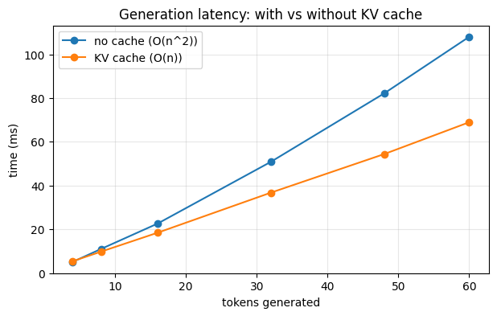

# 09 — Sampling and the KV cache

Code companion to [`../inference.md`](../inference.md).

Inference is where most user-facing knobs live (temperature, top-p, repetition penalty) and where most engineering effort goes (KV cache, FlashAttention, paged attention, speculative decoding).

This notebook covers the two foundations:

1. **Sampling strategies** — what the model does *after* it produces logits: greedy, temperature, top-k, top-p
2. **KV cache** — the trick that turns generation from `O(n²)` per token into `O(n)`. The reason long-context inference is even feasible.

We'll reuse MiniGPT from notebook 06/07. If you have a `miniGPT_best.pt` checkpoint from notebook 07 it'll load that; otherwise we train a quick one inline.

## Setup


```python
import os, math, time, urllib.request
import torch
import torch.nn as nn
import torch.nn.functional as F
import matplotlib.pyplot as plt
import numpy as np

torch.manual_seed(42)
device = "cuda" if torch.cuda.is_available() else "cpu"
print(f"PyTorch {torch.__version__}, device {device}")

# Tiny Shakespeare
DATA_URL = "https://raw.githubusercontent.com/karpathy/char-rnn/master/data/tinyshakespeare/input.txt"
DATA_PATH = "tinyshakespeare.txt"
if not os.path.exists(DATA_PATH):
    urllib.request.urlretrieve(DATA_URL, DATA_PATH)
with open(DATA_PATH, encoding="utf-8") as f:
    text = f.read()

chars = sorted(set(text))
vocab_size = len(chars)
ctoi = {c: i for i, c in enumerate(chars)}
itoc = {i: c for i, c in enumerate(chars)}
encode = lambda s: [ctoi[c] for c in s]
decode = lambda ids: "".join(itoc[i] for i in ids)
```

    PyTorch 2.11.0+cpu, device cpu


```python
# Same MiniGPT as notebooks 06/07 (compact)
class CausalSelfAttention(nn.Module):
    def __init__(self, d_model, num_heads, block_size):
        super().__init__()
        self.num_heads, self.d_k = num_heads, d_model // num_heads
        self.qkv  = nn.Linear(d_model, 3*d_model, bias=False)
        self.proj = nn.Linear(d_model, d_model, bias=False)
        self.register_buffer("mask", torch.tril(torch.ones(block_size, block_size, dtype=torch.bool)))
    def forward(self, x):
        B, T, C = x.shape
        q, k, v = self.qkv(x).chunk(3, dim=-1)
        q = q.view(B, T, self.num_heads, self.d_k).transpose(1, 2)
        k = k.view(B, T, self.num_heads, self.d_k).transpose(1, 2)
        v = v.view(B, T, self.num_heads, self.d_k).transpose(1, 2)
        s = (q @ k.transpose(-2,-1)) / (self.d_k ** 0.5)
        s = s.masked_fill(~self.mask[:T,:T], float("-inf"))
        return self.proj((F.softmax(s, dim=-1) @ v).transpose(1,2).contiguous().view(B, T, C))

class Block(nn.Module):
    def __init__(self, d_model, num_heads, block_size):
        super().__init__()
        self.ln1, self.ln2 = nn.LayerNorm(d_model), nn.LayerNorm(d_model)
        self.attn = CausalSelfAttention(d_model, num_heads, block_size)
        self.mlp  = nn.Sequential(nn.Linear(d_model, 4*d_model), nn.GELU(), nn.Linear(4*d_model, d_model))
    def forward(self, x):
        x = x + self.attn(self.ln1(x))
        return x + self.mlp(self.ln2(x))

class MiniGPT(nn.Module):
    def __init__(self, vocab_size, d_model=128, num_heads=4, num_layers=4, block_size=64):
        super().__init__()
        self.block_size = block_size
        self.token_emb = nn.Embedding(vocab_size, d_model)
        self.pos_emb   = nn.Embedding(block_size, d_model)
        self.blocks    = nn.ModuleList([Block(d_model, num_heads, block_size) for _ in range(num_layers)])
        self.ln_f      = nn.LayerNorm(d_model)
        self.head      = nn.Linear(d_model, vocab_size, bias=False)
    def forward(self, idx):
        B, T = idx.shape
        x = self.token_emb(idx) + self.pos_emb(torch.arange(T, device=idx.device))
        for block in self.blocks: x = block(x)
        return self.head(self.ln_f(x))

model = MiniGPT(vocab_size).to(device)

# Try to load notebook 07's checkpoint
if os.path.exists("miniGPT_best.pt"):
    ckpt = torch.load("miniGPT_best.pt", weights_only=False, map_location=device)
    model.load_state_dict(ckpt["model"])
    print(f"Loaded checkpoint from notebook 07 (val_loss {ckpt['val_loss']:.3f})")
else:
    # Train a quick one inline (~30s)
    print("No checkpoint found; training a quick model (300 steps) for the demos.")
    data = torch.tensor(encode(text), dtype=torch.long)
    train_data = data[:int(0.9 * len(data))]
    BLOCK_SIZE, BATCH_SIZE = 64, 32
    def get_batch():
        ix = torch.randint(len(train_data) - BLOCK_SIZE - 1, (BATCH_SIZE,))
        x = torch.stack([train_data[i : i + BLOCK_SIZE] for i in ix])
        y = torch.stack([train_data[i + 1 : i + BLOCK_SIZE + 1] for i in ix])
        return x.to(device), y.to(device)
    opt = torch.optim.AdamW(model.parameters(), lr=3e-4)
    for step in range(300):
        xb, yb = get_batch()
        logits = model(xb)
        loss = F.cross_entropy(logits.reshape(-1, logits.size(-1)), yb.reshape(-1))
        opt.zero_grad(); loss.backward(); opt.step()
        if (step+1) % 100 == 0: print(f"step {step+1}: loss {loss.item():.3f}")

model.eval()
print(f"Ready. params: {sum(p.numel() for p in model.parameters()):,}")
```

    Loaded checkpoint from notebook 07 (val_loss 2.259)
    Ready. params: 816,128


# Part 1: sampling strategies

After a forward pass, the model gives us **logits** for the next token — one number per vocab entry. How do we pick a token? Different strategies make different trade-offs between coherence and creativity.

We'll implement five and compare side-by-side: **greedy**, **temperature**, **top-k**, **top-p**, **repetition penalty**.

First a tiny helper that runs the model and returns the next-token logits (the only thing sampling cares about):


```python
@torch.no_grad()
def next_logits(model, idx):
    """One forward pass; return logits for the *last* position only."""
    idx_cond = idx[:, -model.block_size:]
    logits = model(idx_cond)
    return logits[:, -1, :]
```

## Greedy: argmax

Simplest. Always pick the most likely next token. Deterministic. Tends to fall into loops because it never explores.

```
next_token = argmax(logits)
```


```python
@torch.no_grad()
def generate_greedy(model, prompt, max_new=120):
    idx = torch.tensor([encode(prompt)], dtype=torch.long, device=device)
    for _ in range(max_new):
        logits = next_logits(model, idx)
        next_tok = logits.argmax(dim=-1, keepdim=True)
        idx = torch.cat([idx, next_tok], dim=1)
    return decode(idx[0].tolist())

torch.manual_seed(0)
print("=== greedy ===")
print(generate_greedy(model, "\n"))
```

    === greedy ===


    
    The the the the the the theat the the the the the the theat the t the the thean
    The the the the the the the the the the 


## Temperature

Divide logits by `T` before softmax. 
- `T < 1`: sharpens distribution → more deterministic
- `T = 1`: softmax as-is
- `T > 1`: flattens distribution → more random
- `T = 0`: equivalent to greedy (limit)

```
probs = softmax(logits / T)
next_token = sample(probs)
```


```python
@torch.no_grad()
def generate_temperature(model, prompt, max_new=120, T=1.0):
    idx = torch.tensor([encode(prompt)], dtype=torch.long, device=device)
    for _ in range(max_new):
        logits = next_logits(model, idx) / max(T, 1e-9)
        probs = F.softmax(logits, dim=-1)
        next_tok = torch.multinomial(probs, num_samples=1)
        idx = torch.cat([idx, next_tok], dim=1)
    return decode(idx[0].tolist())

for T in [0.3, 0.7, 1.0, 1.5]:
    torch.manual_seed(7)  # same seed so randomness is comparable
    print(f"=== T={T} ===")
    print(generate_temperature(model, "\n", max_new=80, T=T))
    print()
```

    === T=0.3 ===
    
    And mand the the so the the the seat the the ane the the
    The the that the that t
    
    === T=0.7 ===


    
    At 's mat co wilorde le!
    
    ANUCHELEES:
    And hit be mye thifors bererof he thee sha
    
    === T=1.0 ===
    
    At 's mat cos: lorok latt'e y Saseres
    Ane hit be mye tamfors ber bof haksweem, f
    
    === T=1.5 ===


    
    Dt!'Tantercos: loroky hot'e; wissertermoup
    Rrabe k-et ymforstert rof hUksweem, f
    


## Top-k

Only consider the `k` most-likely tokens; set the rest to `-inf` before softmax. Bounds randomness without flattening the head of the distribution.

Combines well with temperature.


```python
def filter_top_k(logits, k):
    """Keep only top-k logits; mask the rest with -inf so they're zero in softmax."""
    if k is None or k == 0:
        return logits
    topk_vals = torch.topk(logits, k, dim=-1).values
    threshold = topk_vals[:, -1, None]            # k-th largest value per row
    return logits.masked_fill(logits < threshold, float("-inf"))

@torch.no_grad()
def generate(model, prompt, max_new=120, T=1.0, top_k=None, top_p=None):
    """Configurable sampler — T, top_k, top_p compose."""
    idx = torch.tensor([encode(prompt)], dtype=torch.long, device=device)
    for _ in range(max_new):
        logits = next_logits(model, idx) / max(T, 1e-9)
        if top_k is not None:
            logits = filter_top_k(logits, top_k)
        if top_p is not None:
            logits = filter_top_p(logits, top_p)
        probs = F.softmax(logits, dim=-1)
        next_tok = torch.multinomial(probs, num_samples=1)
        idx = torch.cat([idx, next_tok], dim=1)
    return decode(idx[0].tolist())
```

## Top-p (nucleus sampling, Holtzman et al. 2019)

Keep the **smallest set** of tokens whose cumulative probability is at least `p`; sample from those. Adapts to the shape of the distribution: when the model is confident (sharp distribution), only 1-2 tokens make the cut; when uncertain (flat distribution), more do.

This is the default sampler in many production APIs.


```python
def filter_top_p(logits, p):
    """Keep smallest set of tokens whose cumulative probability >= p."""
    if p is None or p >= 1.0:
        return logits
    sorted_logits, sorted_indices = torch.sort(logits, descending=True, dim=-1)
    cum_probs = F.softmax(sorted_logits, dim=-1).cumsum(dim=-1)
    # Mask: keep tokens whose CUMULATIVE prob *up to and including this token* is in the nucleus
    keep = cum_probs - F.softmax(sorted_logits, dim=-1) < p
    keep[:, 0] = True  # always keep at least the most-likely token
    sorted_logits = torch.where(keep, sorted_logits, torch.full_like(sorted_logits, float("-inf")))
    # Restore original order
    return sorted_logits.scatter(1, sorted_indices, sorted_logits)

for cfg in [
    {"T": 1.0, "top_k": 10},
    {"T": 1.0, "top_p": 0.9},
    {"T": 0.8, "top_k": 40, "top_p": 0.95},
]:
    torch.manual_seed(7)
    print(f"=== {cfg} ===")
    print(generate(model, "\n", max_new=80, **cfg))
    print()
```

    === {'T': 1.0, 'top_k': 10} ===
    
    At dil tho meno thon heat'e mansser herou hit be myes
    Anor stout bof han weer, f
    
    === {'T': 1.0, 'top_p': 0.9} ===


    
    At dil tho meno orde lattseal waser hem fotheace mees
    Ang wat me rofar whatem, f
    
    === {'T': 0.8, 'top_k': 40, 'top_p': 0.95} ===
    
    At dil tho meno orde lattseal waser hem fotheace mee thif wit me bead
    We ween, f
    


# Part 2: the KV cache

Watch what happens when we generate one token at a time:

- **Step 1**: process token 0 → output predicts token 1
- **Step 2**: process tokens [0, 1] → output predicts token 2
- **Step 3**: process tokens [0, 1, 2] → output predicts token 3
- ... and so on

**We're recomputing the K and V vectors for tokens we already saw, every step.** Tokens 0's K and V vectors are identical at every step — but we recompute them n times to generate n new tokens.

The fix: cache them. After step 1, save K₀, V₀. At step 2, only compute K₁, V₁ for the new token; concatenate with cached K₀, V₀ for the attention computation.

Cost analysis:
- **Without cache**: each step is `O(n)` work (forward pass over n tokens) → `O(n²)` to generate n tokens
- **With cache**: each step is `O(1)` work (forward pass over 1 token) → `O(n)` to generate n tokens

This is *the* difference that makes long-context inference practical.

## Implementation

Two changes from the regular MiniGPT:

1. **Attention** accepts an optional `past_kv = (K_past, V_past)`. If present, it (a) concatenates new K/V with the past, and (b) reuses position offsets so the causal mask is correct. Returns updated `(K, V)` to be cached.
2. **Generate** maintains a list of `past_kv` (one per layer), passes them through, and for each new token runs the model on *just that one token* instead of the whole sequence.

We define cached versions side-by-side with the originals so you can see the diff.


```python
class CachedAttention(nn.Module):
    """Self-attention that takes/returns a (K, V) cache."""
    def __init__(self, d_model, num_heads, block_size):
        super().__init__()
        self.num_heads, self.d_k = num_heads, d_model // num_heads
        self.qkv  = nn.Linear(d_model, 3*d_model, bias=False)
        self.proj = nn.Linear(d_model, d_model, bias=False)
        self.register_buffer("mask", torch.tril(torch.ones(block_size, block_size, dtype=torch.bool)))

    def forward(self, x, past_kv=None):
        B, T_new, C = x.shape
        q, k, v = self.qkv(x).chunk(3, dim=-1)
        q = q.view(B, T_new, self.num_heads, self.d_k).transpose(1, 2)
        k = k.view(B, T_new, self.num_heads, self.d_k).transpose(1, 2)
        v = v.view(B, T_new, self.num_heads, self.d_k).transpose(1, 2)

        # Concatenate past K, V if cached
        if past_kv is not None:
            k = torch.cat([past_kv[0], k], dim=2)  # (B, h, T_total, d_k)
            v = torch.cat([past_kv[1], v], dim=2)
        T_total = k.size(2)

        # Causal mask: rows = new query positions, cols = all keys
        # New queries are at positions [T_total-T_new, T_total)
        scores = (q @ k.transpose(-2, -1)) / (self.d_k ** 0.5)
        causal = self.mask[T_total-T_new:T_total, :T_total]
        scores = scores.masked_fill(~causal, float("-inf"))

        y = F.softmax(scores, dim=-1) @ v
        y = y.transpose(1, 2).contiguous().view(B, T_new, C)
        return self.proj(y), (k, v)

class CachedBlock(nn.Module):
    def __init__(self, d_model, num_heads, block_size):
        super().__init__()
        self.ln1, self.ln2 = nn.LayerNorm(d_model), nn.LayerNorm(d_model)
        self.attn = CachedAttention(d_model, num_heads, block_size)
        self.mlp  = nn.Sequential(nn.Linear(d_model, 4*d_model), nn.GELU(), nn.Linear(4*d_model, d_model))
    def forward(self, x, past_kv=None):
        a, kv = self.attn(self.ln1(x), past_kv)
        x = x + a
        x = x + self.mlp(self.ln2(x))
        return x, kv

class CachedMiniGPT(nn.Module):
    def __init__(self, vocab_size, d_model=128, num_heads=4, num_layers=4, block_size=64):
        super().__init__()
        self.block_size = block_size
        self.token_emb = nn.Embedding(vocab_size, d_model)
        self.pos_emb   = nn.Embedding(block_size, d_model)
        self.blocks    = nn.ModuleList([CachedBlock(d_model, num_heads, block_size) for _ in range(num_layers)])
        self.ln_f      = nn.LayerNorm(d_model)
        self.head      = nn.Linear(d_model, vocab_size, bias=False)

    def forward(self, idx, past_kvs=None):
        B, T_new = idx.shape
        # If past, position embedding starts after the past length
        offset = 0 if past_kvs is None else past_kvs[0][0].size(2)
        pos = torch.arange(offset, offset + T_new, device=idx.device)
        x = self.token_emb(idx) + self.pos_emb(pos)

        new_past_kvs = []
        for i, block in enumerate(self.blocks):
            past = None if past_kvs is None else past_kvs[i]
            x, kv = block(x, past)
            new_past_kvs.append(kv)
        return self.head(self.ln_f(x)), new_past_kvs

# Build a cached model and copy the trained weights from the regular one.
# We can do this because the layer structure is identical — only the forward
# signature differs.
cached = CachedMiniGPT(vocab_size).to(device).eval()
cached.load_state_dict(model.state_dict())
print("Cached model built; weights copied.")
```

    Cached model built; weights copied.


```python
@torch.no_grad()
def generate_cached(cached_model, prompt, max_new=120, T=0.8):
    """Generation using KV cache: only one token's worth of forward per step."""
    idx = torch.tensor([encode(prompt)], dtype=torch.long, device=device)

    # Prefill: process the prompt in one shot, build the initial cache
    logits, past_kvs = cached_model(idx)
    last = logits[:, -1, :]

    out = idx[0].tolist()
    for _ in range(max_new):
        next_tok = torch.multinomial(F.softmax(last / T, dim=-1), num_samples=1)
        out.append(next_tok.item())
        if past_kvs[0][0].size(2) >= cached_model.block_size:
            break  # context full
        # Decode step: just the one new token
        logits, past_kvs = cached_model(next_tok, past_kvs=past_kvs)
        last = logits[:, -1, :]
    return decode(out)

# Sanity: cached generation should produce sensible text and match the
# uncached version when we use greedy + identical seed.
torch.manual_seed(0)
print("=== cached generation ===")
print(generate_cached(cached, "\n", max_new=80, T=0.8))
```

    === cached generation ===


    
    th remh thit whenlle bouce meaman y id Igelstet My
    pourey hif th


## Benchmark: with vs without cache

Time both at varying generated-token counts. The crossover should be visible: without cache scales quadratically, with cache scales linearly.


```python
@torch.no_grad()
def generate_plain(model, max_new):
    """Uncached: full forward pass at every step."""
    idx = torch.tensor([[0]], dtype=torch.long, device=device)
    for _ in range(max_new):
        idx_cond = idx[:, -model.block_size:]
        logits = model(idx_cond)[:, -1, :]
        next_tok = logits.argmax(dim=-1, keepdim=True)
        idx = torch.cat([idx, next_tok], dim=1)
        if idx.size(1) >= model.block_size:
            break
    return idx

@torch.no_grad()
def generate_kv(cached_model, max_new):
    idx = torch.tensor([[0]], dtype=torch.long, device=device)
    logits, past = cached_model(idx)
    last = logits[:, -1, :]
    for _ in range(max_new):
        next_tok = last.argmax(dim=-1, keepdim=True)
        if past[0][0].size(2) >= cached_model.block_size:
            break
        logits, past = cached_model(next_tok, past_kvs=past)
        last = logits[:, -1, :]
    return idx

# Warmup
_ = generate_plain(model, 8); _ = generate_kv(cached, 8)

lengths = [4, 8, 16, 32, 48, 60]
t_plain, t_kv = [], []
for n in lengths:
    t0 = time.perf_counter(); _ = generate_plain(model, n); t_plain.append(time.perf_counter() - t0)
    t0 = time.perf_counter(); _ = generate_kv(cached,    n); t_kv.append(time.perf_counter() - t0)
    print(f"n={n:3d}: no-cache {t_plain[-1]*1e3:6.1f} ms,  cached {t_kv[-1]*1e3:6.1f} ms,  speedup {t_plain[-1]/t_kv[-1]:.2f}x")

plt.figure(figsize=(7, 4))
plt.plot(lengths, [t*1e3 for t in t_plain], marker="o", label="no cache (O(n^2))")
plt.plot(lengths, [t*1e3 for t in t_kv],    marker="o", label="KV cache (O(n))")
plt.xlabel("tokens generated")
plt.ylabel("time (ms)")
plt.title("Generation latency: with vs without KV cache")
plt.legend(); plt.grid(True, alpha=0.3)
plt.show()
```

    n=  4: no-cache    5.1 ms,  cached    5.4 ms,  speedup 0.94x
    n=  8: no-cache   11.0 ms,  cached    9.8 ms,  speedup 1.13x
    n= 16: no-cache   22.6 ms,  cached   18.5 ms,  speedup 1.23x


    n= 32: no-cache   50.9 ms,  cached   36.8 ms,  speedup 1.38x


    n= 48: no-cache   82.2 ms,  cached   54.4 ms,  speedup 1.51x


    n= 60: no-cache  108.0 ms,  cached   69.0 ms,  speedup 1.57x


    

    


## Prefill vs decode

Inference has two distinct phases with very different performance characteristics:

- **Prefill** — process the entire prompt in one forward pass. Highly parallel across positions, compute-bound. Fast even for long prompts.
- **Decode** — generate output tokens one at a time. Sequential, memory-bandwidth-bound. The slow part for long outputs.

This is why "long input, short output" is much faster than "short input, long output" per token, and why **prompt caching** (Anthropic, OpenAI) gives such large speed-ups: it skips prefill entirely on cache hits.


```python
# Make a long-ish prompt (close to the full context window)
long_prompt = ("To be or not to be that is the question " * 4)[:60]
idx = torch.tensor([encode(long_prompt)], dtype=torch.long, device=device)

# Prefill: one forward pass on the whole prompt
_ = cached(idx)  # warmup
torch.cuda.synchronize() if device == "cuda" else None
t0 = time.perf_counter()
for _ in range(20):
    _, past = cached(idx)
t_prefill = (time.perf_counter() - t0) / 20

# Decode: one token at a time, given the prefilled cache
single = torch.tensor([[0]], dtype=torch.long, device=device)
_ = cached(single, past_kvs=past)  # warmup
torch.cuda.synchronize() if device == "cuda" else None
t0 = time.perf_counter()
for _ in range(20):
    _ = cached(single, past_kvs=past)
t_decode = (time.perf_counter() - t0) / 20

print(f"Prefill (whole {idx.size(1)}-token prompt, single forward): {t_prefill*1e3:.2f} ms total")
print(f"  -> per-prompt-token cost: {t_prefill*1e3/idx.size(1):.2f} ms")
print(f"Decode (one new token, with cache):                       {t_decode*1e3:.2f} ms")
```

    Prefill (whole 60-token prompt, single forward): 2.67 ms total
      -> per-prompt-token cost: 0.04 ms
    Decode (one new token, with cache):                       1.47 ms


## What's next

You now have the full picture of inference. Real production serving systems add:

- **Continuous batching** (vLLM's PagedAttention, Yu et al. 2022) — swap finished sequences out and slot new ones in mid-flight, instead of waiting for the slowest in a batch. Major throughput win
- **Speculative decoding** (Leviathan et al. 2023) — a small "draft" model proposes K tokens, the big model verifies them in one parallel forward pass. 2–3× speedup, identical output distribution
- **FlashAttention** (Dao et al. 2022) — same attention math, IO-aware kernel. Faster *and* uses less memory by avoiding writing the full `(n, n)` attention matrix to HBM
- **Quantisation at serve time** — int8/int4/fp8 weights with bitsandbytes, GPTQ, AWQ, llama.cpp's GGUF
- **Multi-Query / Grouped-Query Attention** — share K/V across heads to shrink the cache

All stack with what we built here. The KV cache is the foundation — none of those optimisations matter without it.

## References

- **Holtzman et al. 2019** — *The Curious Case of Neural Text Degeneration* (nucleus sampling) — [arXiv:1904.09751](https://arxiv.org/abs/1904.09751)
- **Shazeer 2019** — *Fast Transformer Decoding* (multi-query attention) — [arXiv:1911.02150](https://arxiv.org/abs/1911.02150)
- **Ainslie et al. 2023** — *GQA: Grouped-Query Attention* — [arXiv:2305.13245](https://arxiv.org/abs/2305.13245)
- **Leviathan et al. 2023** — *Speculative Decoding* — [arXiv:2211.17192](https://arxiv.org/abs/2211.17192)
- **Dao et al. 2022** — *FlashAttention* — [arXiv:2205.14135](https://arxiv.org/abs/2205.14135)
- **Kwon et al. 2023** — *vLLM / PagedAttention* — [arXiv:2309.06180](https://arxiv.org/abs/2309.06180)

## Exercises

1. **Repetition penalty.** Add a `repetition_penalty` knob to `generate`: divide logits of already-seen tokens by `1.1`. Does greedy generation become less loopy?
2. **Min-p sampling.** Implement `filter_min_p`: keep tokens with probability ≥ `min_p * top_prob`. Compare to top-p — when does it differ?
3. **Verify cached == uncached.** With same input + greedy decoding, the cached and uncached generations should be *bit-identical*. Confirm.
4. **KV cache memory footprint.** Compute the memory used by the cache as a function of `n_layers, num_heads, head_dim, seq_len, batch, dtype`. For LLaMA-3 8B at 32k context, batch 1, fp16, what's the cache size?
5. **GQA.** Modify `CachedAttention` to share K/V across pairs of heads (4 heads → 2 K/V groups). What changes about the cache size?
6. **Speculative decoding lite.** Use a smaller, faster MiniGPT to draft 4 tokens, then have the bigger model verify them in one forward pass. Implement the accept/reject loop.
